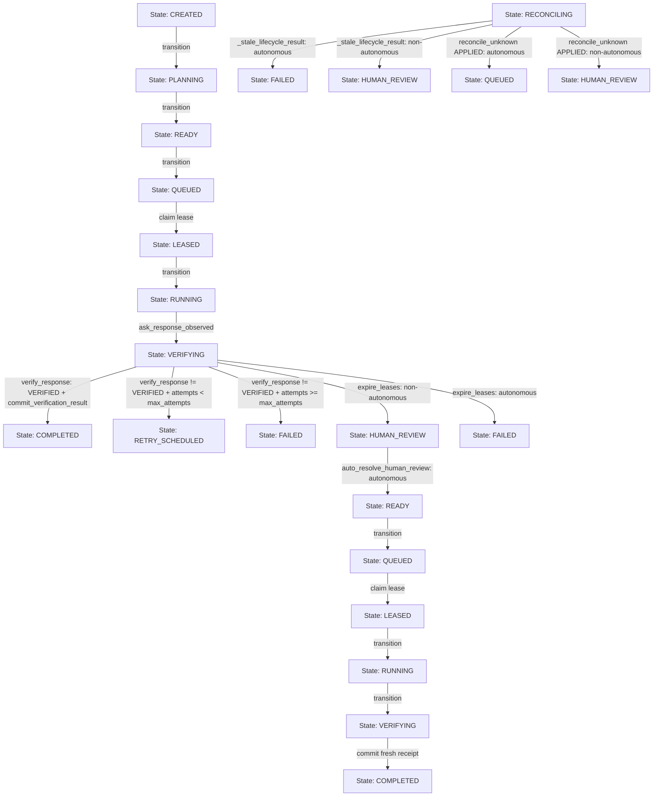

# Causal Graph & Coverage Matrix — Milestone 1 (Requirement R1)

## 1. System Context & Invariant Boundaries
- Target Files: `scp/ask_kernel_adapter.py`, `scp/task_kernel_parts/taskkernel.py`
- Core Invariant: Zero modification to 17 core states in `scp/task_kernel.py`; zero modification to `ALLOWED_TRANSITIONS`.
- Goal: Full autonomous lifecycle progression without parking in `HUMAN_REVIEW`, strictly preserving Zero-Trust and Fail-Closed principles.

## 2. Mermaid Causal Graph (Full Lifecycle & Error Paths)

## 3. Peripheral Audit (FA-11 Compliance)
1. **Preconditions & Guards**:
   - `auto_resolve_human_review`: Precondition is strictly `task["state"] == "HUMAN_REVIEW"`. Rejects non-HUMAN_REVIEW with `InvalidTransition`.
   - `fail_task_fail_closed`: Only permits transitions where `FAILED in ALLOWED_TRANSITIONS.get(old_state)`. Terminal states return idempotently.
   - `expire_leases`: When `cur_state == 'VERIFYING'` under autonomous mode, directly transitions to `FAILED` with `LEASE_EXPIRED` event and released lease.
   - `reconcile_unknown`: When `outcome == 'APPLIED'`, under autonomous mode routes to `QUEUED` (a valid edge from `RECONCILING`), preserving retryability and lease fencing.
2. **Hidden Gap Sweep**:
   - Checked all occurrences of `_escalate_to_human_review` in `scp/ask_kernel_adapter.py`: Exactly 2 call sites exist (stale lifecycle, and verification failure). Both are cleanly branched on `self.autonomous_mode`.
   - Checked optimistic concurrency control (OCC) across all SQLite updates: All updates check `version = cur_version` and increment `version = version + 1`.

## 4. Coverage Matrix (FA-13 Compliance)

| Branch ID | Causal Path | Mode | Target State | Test Coverage |
|---|---|---|---|---|
| B1 | Happy Path: RUNNING -> VERIFYING -> commit | Autonomous | COMPLETED | `test_autonomous_happy_path_completes_without_human_review` |
| B2 | Verification Failed (attempts < max) | Autonomous | RETRY_SCHEDULED | `test_autonomous_verification_failed_retries` |
| B3 | Verification Failed (attempts >= max) | Autonomous | FAILED | `test_autonomous_verification_failed_terminal` |
| B4 | Race: commit races watchdog to HUMAN_REVIEW | Autonomous | COMPLETED (via auto-resolve) | `test_autonomous_race_to_human_review_auto_resolves_and_completes` |
| B5 | Stale lifecycle authority | Autonomous | FAILED (fail-closed) | `test_autonomous_stale_lifecycle_fails_closed` |
| B6 | Lease expiry during VERIFYING | Autonomous | FAILED | `test_autonomous_expire_leases_verifying_fails_closed` |
| B7 | Reconcile unknown APPLIED with evidence | Autonomous | QUEUED | `test_autonomous_reconcile_applied_routes_to_queued` |
| B8 | auto_resolve_human_review invalid state | Autonomous | InvalidTransition | `test_auto_resolve_human_review_invalid_state_raises` |
| B9 | Baseline Happy Path | Non-autonomous | COMPLETED | `test_normal_running_finalize_path_is_unchanged` |
| B10 | Baseline Stale Reconciling | Non-autonomous | HUMAN_REVIEW | `test_finalize_from_reconciling_returns_withheld_result_not_500` |
| B11 | Baseline Verification Failed | Non-autonomous | HUMAN_REVIEW | `test_double_escalation_is_idempotent_noop_not_raise` |
| B12 | Baseline Expire Leases VERIFYING | Non-autonomous | HUMAN_REVIEW | `test_verified_commit_racing_stale_lease_does_not_500` |
