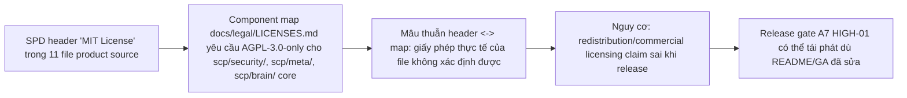

# EMERGENCY GAP REPORT — A7 lân cận: MIT license headers trái component map (FA-11)

- **Ngày:** 2026-10-01 · **Branch:** `fix/audit-round2-remediation-20261001`
- **Phát hiện bởi:** FIX AGENT (doc/config lane) khi chạy verify cuối của fix A7 HIGH-01 (`git grep "MIT License"` repo-wide).
- **Phạm vi:** GAP lân cận nằm NGOÀI scope file-ownership của agent này (product source + release guide) → báo cáo, KHÔNG tự vá (FA-11 bước 1: Anti-Scope Creep).

## Sơ đồ nhân quả (Mermaid)



## Bằng chứng (git grep trên working tree 2026-10-01)

```text
scp/brain/error_store.py:7:Licensed under the MIT License.
scp/brain/error_store_index.py:3:Copyright (c) 2026 Minh / SCP V4 Project. MIT License.
scp/meta/falsification_engine.py:3:Copyright (c) 2026 Minh / SCP V4 Project. MIT License.
scp/security/attack_classifier.py:3:Copyright (c) 2026 Minh. MIT License.
scp/security/attack_memory.py:3:Copyright (c) 2026 Minh. MIT License.
scp/security/attack_policy.py:3:Copyright (c) 2026 Minh. MIT License.
scp/security/canary_monitor.py:3:Copyright (c) 2026 Minh. MIT License.
scp/security/counter_response.py:3:Copyright (c) 2026 Minh. MIT License.
scp/security/memory_guard.py:3:Copyright (c) 2026 Minh. MIT License.
scp/security/threat_detector.py:3:Copyright (c) 2026 Minh. MIT License.
scp/security/threat_simulator.py:3:Copyright (c) 2026 Minh. MIT License.
docs/PUBLIC_RELEASE_GUIDE.md:240:- [ ] **GitHub repo** — public, with MIT license
```

## Đề xuất xử lý (cho owner / lane có quyền)

1. Đổi header 11 file product sang `# SPDX-License-Identifier: AGPL-3.0-only` + copyright dòng chuẩn theo `docs/legal/LICENSES.md` §2 — HOẶC nếu các file này là extension tách biệt được thì thêm vào component map §3 (Apache-2.0) kèm dependency review. Con người quyết định (DNA #4).
2. `docs/PUBLIC_RELEASE_GUIDE.md:240`: sửa checklist "MIT license" → multi-license theo `LICENSE` + `docs/legal/LICENSES.md`.

## Đánh giá mức độ

- **Mức:** MEDIUM (legal consistency, không phải runtime vulnerability).
- **Ảnh hưởng tới task hiện tại:** KHÔNG làm task hiện tại vô nghĩa — README/GA/skills index đã hết claim MIT; gap này nằm ở header source + release guide. Task doc/config tiếp tục và được commit riêng.
- **Trạng thái:** OPEN — chờ owner/lane product xử lý.
