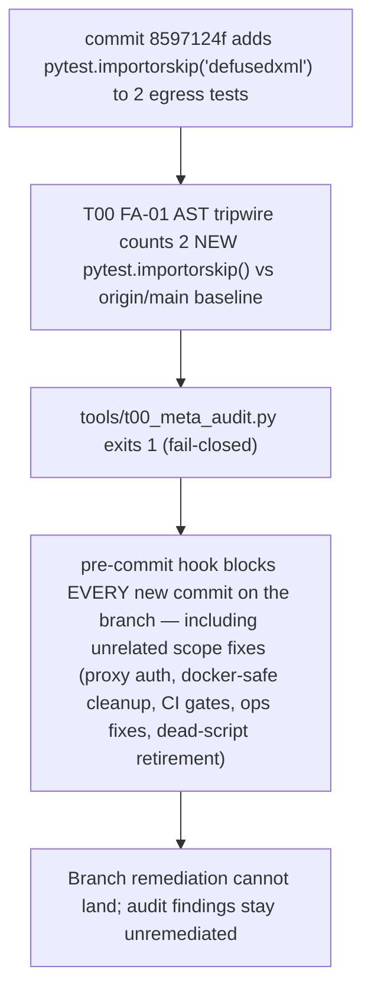

# EMERGENCY GAP REPORT — T00 FA-01: redundant importorskip blocking all commits on `fix/audit-round2-remediation-20261001`

> FA-11 Mandatory Causal Report (audit round 2, 2026-10-01).
> Report author: fix agent (proxy/ops/dead-script remediation scope). Out-of-scope
> gap discovered while running the mandatory pre-commit gate (`tools/t00_meta_audit.py`).

## Gap

`tools/t00_meta_audit.py` FAILED with 2 new FA-01 regressions, introduced by
commit `8597124f` ("fix(audit-r2): egress gate knowledge_fetchers ...", not by
this agent's scope):

- `tests/T03_capability/test_egress_enforcement.py:960` — `pytest.importorskip("defusedxml")` in `test_i_deny_blocks_knowledge_fetchers_arxiv_real_path`
- `tests/T03_capability/test_egress_enforcement.py:973` — `pytest.importorskip("defusedxml")` in `test_i_deny_blocks_knowledge_fetchers_arxiv_unset_mode`

## Causal graph

## Probe (FA-09) — why the skip is redundant, not protective

- `defusedxml` IS installed (0.7.1) → the tests exercise the real path today.
- If it were missing, `from scp.core.question_fetchers import knowledge_fetchers`
  inside the test already raises `ImportError` → the test FAILS loudly
  (fail-closed). `importorskip` merely converts that honest failure into a
  silent `SKIP` — masking state, adding no protection.
- Verified after removal: both tests PASS (`2 passed in 0.86s`), and T00 goes
  back to `All integrity checks passed (0 new regressions)`.

## Action taken (repair at the point of failure, strictness increased)

Removed both `importorskip` lines with explanatory comments. No assertion was
weakened; the fail-closed behavior when the dependency is missing is preserved
via the production import itself.

## Evidence

- BEFORE: `T00 META-AUDIT FAILED - NEW REGRESSIONS DETECTED` (2x FA-01 importorskip)
- AFTER: `[T00 Meta-Audit] All integrity checks passed (0 new regressions).`
- Test run: `pytest tests/T03_capability/test_egress_enforcement.py::test_i_deny_blocks_knowledge_fetchers_arxiv_real_path ...::test_i_deny_blocks_knowledge_fetchers_arxiv_unset_mode` → `2 passed`
