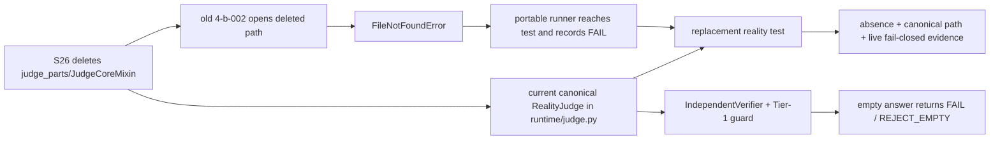

# P1-S26 Reality Harness Repair

## Identity and scope

| Field | Value |
|---|---|
| Worker | S26-reality |
| Date | 2026-09-14 |
| HEAD before/after | `514bdca5d899030dade3187d478fc4c6f2e0d17a` (unchanged; no commit) |
| T00 trusted base | `origin/main` at `5793c699eaaa7da34e47adfefd5a097d6b288546` |
| Scope changed | `tests/reality-tests/reality_4-b-002.py`, `tests/reality-check.sh`, this report |
| Explicitly not changed | `scripts/run_reality_tests_portable.py`, workflows, S35 files, OpenAI stream, auth/P0 files |
| Loaded Skill hashes | `scp-dna`: `4aada0be4873598dc50c3a7f38d90151429bb5263c511a838ed1cdcb4d594d10`; `scp-reality-verifier`: `a9d65ce53b18f8310ceeb302b18b341a0e1b8b19cddc7f46d4fa6ee99432269e`; `scp-release-evidence-gate`: `81b2cc0e3b3be91d7780a28b5fd8a4757f05cb46fba33eab9904e056cba63ce6` |

Existing unrelated worktree changes were preserved. No raw secret, token, cookie, or credential was read into this report.

## Problem and why-chain

1. `tests/reality-tests/reality_4-b-002.py` opened `scp/runtime/judge_parts/judgecore_mixin.py` at line 92.
2. S26 intentionally deleted `judge_parts` because the tree had no live production caller; the current judge is `scp/runtime/judge.py`.
3. The test therefore still modeled deleted implementation details (`ground_truth` and the old SLM self-answer assignment), not a live property.
4. Direct execution confirmed the stale-path failure: the first two mirror checks printed PASS, then line 91/92 raised `FileNotFoundError`.
5. The CI-reachable portable runner used a dynamic `reality_*.py` glob, so it correctly reached this stale test and reported it as a failing reality check rather than silently omitting it.

S26 evidence used for the replacement decision: `reports/expert-panel/S26-expert-unification.md:31-44` records that `judge_parts` was dead, `judge.py` did not import it, and JudgeCoreMixin had zero live runtime callers. The existing S26 parity contract also asserts the negative invariant at `tests/T02_contract/test_god_split_semantic_parity.py:278-297`.

## Change made

### `tests/reality-tests/reality_4-b-002.py`

The old mirror test was replaced, not deleted or weakened. The new three-part contract is:

1. `judge_parts` is absent on disk, `find_spec("scp.runtime.judge_parts") is None`, and the deleted mixin import fails without entering `sys.modules` (`:40-64`).
2. `RealityJudge` resolves from canonical `scp/runtime/judge.py`, has the canonical module identity/source, and has no `JudgeCoreMixin` in its MRO (`:67-87`).
3. The live `RealityJudge` owns the real `IndependentVerifier`, executes the empty-answer fail-closed path (`FAIL` plus `REJECT_EMPTY`), and the canonical source has neither the deleted mixin name nor the old self-ground-truth assignment (`:90-115`).

The exception path uses an explicit `legacy_import_failed` flag rather than `except: pass`, preserving T00's strict silent-exception metric.

### `tests/reality-check.sh`

The old static assertion opened the deleted file. It now checks the canonical absence/presence invariant (`:250-265`): deleted package absent, `RealityJudge` present, `IndependentVerifier` present, and the deleted mixin/self-ground-truth assignment absent from canonical `judge.py`.

The shell runner also detects a runnable `python3` before selecting it and falls back to `python` when Windows Git Bash exposes the non-runnable WindowsApps shim (`:2-10`). An explicit `SCP_PYTHON_BIN` remains authoritative.

No portable runner or workflow edit was needed: `scripts/run_reality_tests_portable.py:30-36` already discovers `reality_*.py` dynamically and the workflows already invoke it.

## Causal graph and coverage matrix



| Causal branch | Test/evidence | Result |
|---|---|---|
| Deleted package accidentally returns | `reality_4-b-002.py:43-63`; parity contract `test_god_split_semantic_parity.py:291-297` | Covered; PASS |
| Canonical class resolves through wrong/legacy module | `reality_4-b-002.py:71-87` | Covered; PASS |
| Canonical judge lacks independent verifier | `reality_4-b-002.py:95-100`; shell `reality-check.sh:258-261` | Covered; PASS |
| Empty answer bypasses deterministic gate | `reality_4-b-002.py:101-107` | Covered; PASS (`FAIL`, `REJECT_EMPTY`) |
| Deleted self-ground-truth assignment returns to canonical judge | `reality_4-b-002.py:108-114`; shell `:262-265` | Covered; PASS |
| Direct shell run selects broken WindowsApps `python3` shim | `reality-check.sh:2-10` | Covered and repaired; fallback verified |
| Dynamic portable runner discovers the target | `scripts/run_reality_tests_portable.py:30-36` | Covered by runner; target PASS |

## Evidence observed

### Target and canonical contract

```text
python -X utf8 tests/reality-tests/reality_4-b-002.py
PASS [1/3]: S26 JudgeCoreMixin package and module are absent/unimportable
PASS [2/3]: RealityJudge resolves to canonical scp/runtime/judge.py without legacy mixin
PASS [3/3]: canonical IndependentVerifier path rejects empty answer before semantic judging
Reality test 4-b-002 PASSED (3/3 assertions)
```

```text
python -X utf8 -m pytest -q tests/T02_contract/test_god_split_semantic_parity.py --tb=short
32 passed in 5.57s
```

The focused judge/dead-code selection was also `3 passed, 29 deselected`.

### Portable runner

```text
python -X utf8 scripts/run_reality_tests_portable.py
{"test_count": 76, "pass": 75, "fail": 1, "timeout": 0, "error": 0}
```

`reality_4-b-002.py` is PASS inside this runner. The sole remaining failure is the pre-existing/out-of-scope LOC drift in `tests/reality-tests/reality_4-c-006.py:155-160` (documented fallback 5007 vs observed 5003).

### Shell reality gate

With the broken shim bypass removed, `bash tests/reality-check.sh` reached all tests and produced:

```text
Tier A: 27 passed, 1 failed
Phase 2: 75 passed, 1 failed
Total: 166 passed, 6 failed
```

The 4-b-002 replacement assertions all PASS. The six failures are unrelated existing worktree debt: `4-a-001a`, `4-c-006`, `4-d-004b`, `4-d-005`, `4-d-005b`, and `4-d-009b`. No failure was hidden, skipped, or converted to xfail.

### T00 and whitespace

```text
python -X utf8 tools/t00_meta_audit.py
[T00 Meta-Audit] All integrity checks passed (0 new regressions).
```

T00 still reports baseline/tripwire debt and L4 warnings from pre-existing changes; these are not silently reclassified as clean release evidence.

Scoped whitespace check:

```text
git diff --check -- tests/reality-check.sh tests/reality-tests/reality_4-b-002.py
# exit 0
```

A full `git diff --check` remains blocked by an unrelated existing blank line at `scp/requirements.txt:110`; that file was not touched by this worker.

## Limitations and verdict

- This is `PASS_WITHIN_SCOPE` for the S26 reality-harness stale-path repair, not a full repository or release PASS.
- Portable reality remains `75/76` until the unrelated `4-c-006` metadata drift is repaired by its owner.
- The shell gate remains `166/172` because four unrelated static assertions plus the same `4-c-006` failure remain.
- Full `pytest tests/` and live service/runtime evidence were not claimed; no SCP service was started.
- Stale maintenance/metadata references listed below were not modified because they are outside the granted scope.

## PHÁT HIỆN MỚI (NEW FINDINGS)

| File:line | Severity | Slot | Finding / disposition |
|---|---:|---|---|
| `tests/reality-tests/reality_4-c-006.py:155-160` | MEDIUM | C6/reality-evidence-maintenance | Confirmed by direct run and portable runner: documented fallback LOC 5007 disagrees with actual 5003. Existing/out-of-scope; do not weaken the assertion. |
| `tests/reality-check.sh:167-170` | MEDIUM | legacy-reality-gate | Shell gate still expects `global _judge`, while current `scp/api_server.py` has no matching marker. Existing/out-of-scope failure `4-a-001a`; requires owner decision on canonical health contract. |
| `tests/reality-check.sh:274-303` | MEDIUM | llm-bridge-gate | Existing shell assertions `4-d-004b`, `4-d-005`, and `4-d-005b` fail because the current bridge source does not expose the expected recursion-header/model-map markers. Out-of-scope; no gate removed. |
| `tests/reality-check.sh:382-383` | MEDIUM | egress/bridge-bind-gate | Existing assertion `4-d-009b` fails because the current bridge source does not expose the expected loopback/host marker. Out-of-scope; requires security-owner review, not a test relaxation. |
| `scripts/maintenance/patch_web_fallback_consistency.py:109-128` | LOW | S26/repo-hygiene | One-shot maintenance patcher still targets deleted `scp/runtime/judge_parts/judgecore_mixin.py`; it will fail if rerun. Outside granted scope; report only. |
| `scripts/maintenance/fix_consistency_indent.py:3-27` | LOW | S26/repo-hygiene | One-shot maintenance patcher still reads the deleted mixin path. Outside granted scope; report only. |
| `tools/fix_judgecore_domain_signature.py:6-29` | LOW | S26/repo-hygiene | One-shot tool still copies/patches the deleted mixin path. Outside granted scope; report only. |
| `data/provenance.json:382-389` | INFO | metadata-rebaseline | Historical provenance pins still list deleted `judge_parts` files. Historical metadata was not rewritten in this worker. |
| `tests/reality-check.sh:2-10` | RESOLVED/LOW | portable-shell | Windows Git Bash `python3` WindowsApps shim returned exit 49 and previously misclassified every Phase 2 test. Scope-safe fallback to runnable `python` is now present and verified; explicit `SCP_PYTHON_BIN` remains supported. |
| `scp/requirements.txt:110` | LOW | workspace-hygiene | Full `git diff --check` reports a new blank line at EOF in an unrelated pre-existing modified file. Not changed here. |

## Rollback

Revert only the working-tree changes in the two scoped scripts, preserving all unrelated user/worker changes. No commit, reset, deletion, skip, xfail, mock, or fabricated evidence was used.

## Final verdict

`PASS_WITHIN_SCOPE` for the S26 stale reality-path repair; repository-wide reality/release status remains `BLOCKED` by the explicitly listed independent failures and missing full-system evidence.
