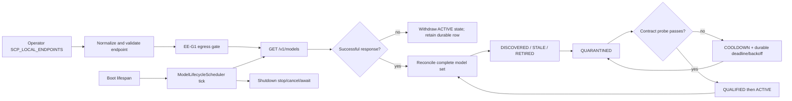

# P1-S35 — Production Model Discovery Lifecycle

- Worker: S35-lifecycle (no-commit)
- Snapshot observed: `39796c008ea62169fccc49644b22e6367feec4c4`
- Branch: `audit/runtime-guard-AUDIT-20260909`
- Date: 2026-09-14
- Scope: `scp/llm_gateway/discovery.py`, `scp/llm_gateway/__init__.py`, `scp/api_server_parts/lifespan.py`, `tests/T05_gateway/test_model_discovery.py`
- Explicitly not touched: S26 reality files, P0 auth, S24 router, OpenAI stream.

## 1. Problem and why-chain

The existing S35 scanner and lifecycle state machine were present, but the system had no production call-site. That meant `run_discovery()` and `run_lifecycle()` were not called on a tick, and persistence was only a library feature.

Why this mattered:

1. Without a production scheduler, discovery could not affect runtime state.
2. Without durable observation timestamps and probe deadlines, a failed probe could be retried on every lifecycle pass.
3. Without reconciliation, a model removed from `/v1/models` remained `ACTIVE` and could continue to be selected by any future consumer of the store.
4. Without an explicit operator endpoint boundary, a future caller could accidentally turn model or prompt data into network destinations.
5. Without an egress check at the concrete transport call-site, endpoint configuration would bypass the EE-G1 static guard.

## 2. Implemented design

### 2.1 Production scheduler and lifespan wiring

`ModelLifecycleScheduler` in `scp/llm_gateway/discovery.py` runs an immediate tick, then bounded configured intervals. Each tick runs discovery first and lifecycle second, records a durable result summary, and catches non-cancellation failures without killing the loop.

`scp/api_server_parts/lifespan.py` constructs the scheduler only from `SCP_LOCAL_ENDPOINTS`, stores it on `app.state.model_lifecycle_scheduler`, starts it during boot, and awaits `stop()` during shutdown. S23's `FreeDiscoveryScheduler` remains separate and unchanged.

Start is fail-closed unless all of these hold:

- at least one endpoint came from operator configuration;
- `SCP_MODEL_DISCOVERY_SCHEDULER` and the existing `SCP_DISCOVERY_SCHEDULER` are not off/disabled;
- the resolved API profile meets `SCP_MODEL_DISCOVERY_MIN_PROFILE` (default `standard`).

The production factory also applies the kill-switch/profile check before opening the state database. No endpoint is accepted from prompt, web, model response, or discovery response.

### 2.2 Endpoint and egress boundary

Configured endpoints are normalized, deduplicated, restricted to HTTP(S), and rejected when credentials, query, or fragment components are present. Internal/private resolution is permitted only because the destination is an explicit operator endpoint; every `/v1/models` and `/v1/chat/completions` transport is still guarded by `validate_url(..., allow_internal=True)` plus `enforce_egress_policy(...)` immediately before the HTTP call.

The EE-G1 static client-call gate initially detected the new `AsyncClient.get` call. The call-site was corrected in the production function scope; it was not hidden by adding a pin.

### 2.3 Durable lifecycle state and migration

FoundationDB migration `0002_lifecycle_observations` adds:

- `last_seen_at`
- `last_probe_at`
- `next_probe_at`
- `probe_failures`
- endpoint index

States now include `STALE` and `RETIRED`. Existing `0001_discovery_state` SQL was preserved byte-for-byte so FoundationDB migration checksum verification remains valid.

### 2.4 Reconciliation and retirement

Only a successful `/v1/models` response is treated as evidence of absence. Failed/unreachable/malformed scans do not reconcile the endpoint, so a transient outage cannot retire every model behind it.

For a successful scan:

- newly seen model: `DISCOVERED`;
- previously `STALE`/`RETIRED` model that reappears: `DISCOVERED`, with a fresh probe required;
- first successful absence: `STALE`;
- repeated successful absence: `RETIRED`.

For an endpoint outage/error:

- first failed observation: all non-terminal models become `STALE`;
- repeated failed observation: `STALE` becomes `RETIRED`;
- endpoint recovery is treated as a fresh discovery and still requires a fresh probe.

`STALE` and `RETIRED` are never probed or activated and are therefore not routable through the lifecycle store. State is retained; no blind deletion is performed.

### 2.5 Probe failure, cooldown, and bounded reprobe

A model reaches `ACTIVE` only through a successful contract probe. A failed probe records `last_probe_at`, increments `probe_failures`, enters `COOLDOWN`, and persists `next_probe_at`.

Reprobe uses exponential backoff bounded by `SCP_MODEL_REPROBE_MAX_SECONDS` and the hard one-day maximum. Base cooldown is configurable through `SCP_MODEL_REPROBE_COOLDOWN_SECONDS`, with a safe default of five minutes. Invalid timestamps keep a model in `COOLDOWN` rather than probing immediately.

## 3. Test/evidence matrix

| Branch | Evidence | Result |
|---|---|---|
| physical loopback discovery and probe | `tests/T05_gateway/test_model_discovery.py`, `test_prober.py` | covered; 25 passed |
| model disappears | physical HTTP server changes model list; `ACTIVE -> STALE -> RETIRED` | covered |
| endpoint outage | physical server shutdown; `ACTIVE -> STALE -> RETIRED`, row retained | covered |
| failed probe | durable cooldown and `next_probe_at` | covered |
| reprobe after deadline/backoff cap | injected clock, real SQLite/FoundationDB | covered |
| restart persistence | close/reopen database and inspect durable row | covered |
| scheduler start/stop/no leak | real asyncio task + physical loopback tick | covered |
| no operator endpoint / kill switch | scheduler start returns `None` | covered |
| egress denial | explicit `SCP_EGRESS_MODE=deny`, no transport | covered |
| EE-G1 static egress census | `tests/T03_capability/test_egress_enforcement.py` | 26 passed, 2 environment-dependent skips |
| S23 regression | `tests/T07_learning/test_discovery_scheduler.py` | 26 passed |
| T01 boot/lifespan | `tests/T01_boot/` | 37 passed |
| T05 full gateway | `tests/T05_gateway/` | 95 passed |
| T00 meta audit | `python tools/t00_meta_audit.py` | exit 0; 0 new regressions |
| full pytest suite | `python -m pytest tests/ -v` | 1773 passed, 25 skipped, exit 0 |
| full portable reality runner | `python scripts/run_reality_tests_portable.py` | 75/76; one pre-existing documentation drift failure |

The T05 test transport guard uses pytest `monkeypatch` only to prevent accidental non-loopback traffic in the hermetic profile. It is explicitly not zero-mock production evidence; lifecycle discovery/probe itself uses physical loopback TCP servers.

## 4. Causal graph and coverage



All branches in this graph have targeted tests in the scope above. Runtime production Docker proof was not run because the task instruction forbids restarting another worker's container; the evidence here is physical local TCP plus boot/lifespan tests.

## 5. Findings and limitations

1. `ACTIVE` is now withdrawn from the lifecycle store after two successful absence observations or two failed endpoint observations. Existing downstream routing code does not currently consume `ModelDiscoveryStore`; a future router integration must query only `ACTIVE` rows and preserve the same egress/capability boundary.
2. The full reality runner remains red because `tests/reality-tests/reality_4-c-006.py` reports documented fallback LOC `5007` versus actual `5003` for six unrelated v4 files. This is outside S35 and was not altered.
3. A combined T01+T05 run showed two existing T05 teardown errors caused by the shared provider test fixture/background work (`free_catalog` attempted a forbidden transport and a closed database); the same T01, full T05, S23, and targeted combined runs passed when executed in isolated processes. This is reported as an evidence limitation, not silently treated as green.
4. The T00 output still lists a pre-existing `duplicate_prompt_template` tripwire debt, while the final T00 exit was 0 with “0 new regressions”.

## PHÁT HIỆN MỚI (NEW FINDINGS)

| File:line | Severity | Slot | Finding |
|---|---|---|---|
| `C:\Users\check\Downloads\scp\tests\reality-tests\reality_4-c-006.py:155` | MEDIUM | P1-S35 adjacent / out-of-scope | Portable reality evidence is blocked by stale documented fallback LOC (`5007`) versus physical total (`5003`). No S35 file was changed. |
| `C:\Users\check\Downloads\scp\tests\T05_gateway\conftest.py:91` | MEDIUM | T05 fixture isolation | In a combined T01+T05 process, teardown observed existing background/provider transport attempts and “Cannot operate on a closed database”; isolated T05 passes 95/95. No S35 production change made. |
| `C:\Users\check\Downloads\scp\scp\api\routes\openai_compat.py:35` (downstream consumer) | LOW / UNPROVEN_BRANCH | S35 handoff | No live call-site currently consumes the new lifecycle store for routing. S35 guarantees non-ACTIVE durable states, but router exclusion of absent models remains a future integration branch. |

## 6. Rollback and scope

Rollback is a reviewed revert of the four scoped files. No commit was made. Existing unrelated workspace modifications and untracked worker artifacts were preserved.

## Skill hashes

```text
4aada0be4873598dc50c3a7f38d90151429bb5263c511a838ed1cdcb4d594d10  .agents/skills/scp-dna/SKILL.md
b60e8eb3a2d2c9de971a001924019cfa0b3038f9c96dfa4e3ac1cb8fca750a5a  .agents/skills/scp-gateway-resilience/SKILL.md
83f1633256756f8e4951471a11b9d45c1738d09f4db851df8ee91ee123a235ee  .agents/skills/scp-capability-security-review/SKILL.md
```
