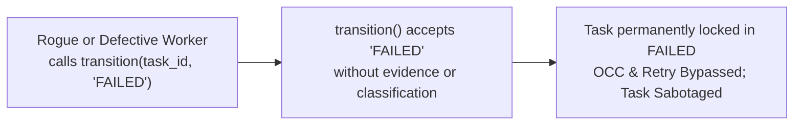
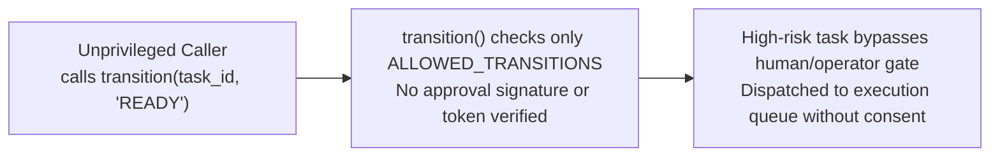

# EMERGENCY GAP REPORT: Peripheral Audit of TaskKernel (FA-11 Compliance)

**Audit Date:** 2026-09-08T00:38:00+07:00  
**Audited Target:** `scp/task_kernel_parts/taskkernel.py` & `scp/task_kernel.py`  
**Auditor:** teamwork_preview_implementer_swe3_r0  
**Authority:** FA-11 Mandatory Peripheral Audit (No Blind Eye) & FA-12 Causal Inspection  

> **STATUS UPDATE (2026-09-12, refresh bởi Agent TB):** GAP-12 và GAP-13 đã được FIX trong commit
> `d0fcb6e` ("fix: R2/R3/R6 remediation + T09/T07 test fixes", 2026-09-09). Bằng chứng:
> - **GAP-12 FIXED:** `commit_failed()` yêu cầu bắt buộc `failure_classification` + `indictment_ref`
>   (`scp/task_kernel_parts/taskkernel.py:1282-1380`); transition() thô vào FAILED bị chặn.
> - **GAP-13 FIXED:** transition() trực tiếp `WAITING_APPROVAL → READY` bị cấm với
>   `InvalidTransition` (`scp/task_kernel_parts/taskkernel.py:419-421`); đường duy nhất là
>   `commit_approval()` với CapabilityToken/operator signature được verify cryptographic
>   (`scp/task_kernel_parts/taskkernel.py:1186+`).
> - Tests pin: `tests/T04_kernel/test_gap13_state_machine_boundaries.py`,
>   `tests/T04_kernel/test_gap13_adversarial_challenge.py`,
>   `tests/T04_kernel/test_adversarial_kernel_flaws.py` (commit_failed).

---

## 1. Executive Summary

During the implementation of **GAP-11** (Fake PASS Bypass in `TaskKernel`), a comprehensive peripheral security audit was conducted on `taskkernel.py` to inspect all adjacent state transitions and evidence gates.

- **Primary Remediated GAP (GAP-11):** Direct raw transition to `COMPLETED` via `transition(task_id, "COMPLETED")` has been blocked by raising `InvalidTransition`. Only `commit_completed()` with verified postcondition evidence and valid lease authority is allowed.
- **Peripheral Findings:** Two serious peripheral vulnerabilities were detected during the scan:
  1. **GAP-12 (Unverified FAILED Transition / Premature Failure Injection):** Calling `transition(task_id, "FAILED")` moves tasks into immutable terminal `FAILED` without verifier indictment, failure classification (retryable vs fatal), or crash evidence.
  2. **GAP-13 (Unauthenticated WAITING_APPROVAL Bypass):** Calling `transition(task_id, "READY")` on tasks in `WAITING_APPROVAL` succeeds without requiring approval token, cryptographic signature, or approver identity check.
- **Anti-Scope Creep Strictness:** In accordance with FA-11 § 1, NO code was modified for GAP-12 or GAP-13. They are formally documented herein for Orchestrator triage and scheduling.

---

## 2. Whole-File Mermaid Causal Graph (`taskkernel.py`)

```mermaid
graph TD
    %% Creation
    subgraph Init["Task Initialization"]
        CT["create_task()"] -->|INSERT tasks & TASK_CREATED event| S_CREATED["State: CREATED"]
    end

    %% Lifecycle Transitions
    subgraph Lifecycle["Task Lifecycle State Machine"]
        S_CREATED -->|transition()| S_PLANNING["State: PLANNING"]
        S_PLANNING -->|transition()| S_READY["State: READY"]
        S_PLANNING -->|transition() [GAP-13 RISK]| S_WAITING_APPROVAL["State: WAITING_APPROVAL"]
        S_WAITING_APPROVAL -->|transition() [GAP-13 BYPASS]| S_READY
        S_READY -->|transition()| S_QUEUED["State: QUEUED"]

        S_QUEUED -->|claim() / claim_next()| S_LEASED["State: LEASED"]
        S_LEASED -->|start() / transition()| S_RUNNING["State: RUNNING"]

        S_RUNNING -->|checkpoint() / transition()| S_WAITING_TOOL["State: WAITING_TOOL"]
        S_RUNNING -->|checkpoint()| S_CHECKPOINTED["State: CHECKPOINTED"]
        S_RUNNING -->|transition()| S_VERIFYING["State: VERIFYING"]

        S_WAITING_TOOL -->|transition()| S_VERIFYING
        S_WAITING_TOOL -->|heartbeat timeout / crash| S_UNKNOWN["State: UNKNOWN"]
        S_RUNNING -->|heartbeat timeout / crash| S_UNKNOWN

        S_UNKNOWN -->|auto_reconcile_orphans()| S_RECOVERING["State: RECOVERING"]
        S_UNKNOWN -->|enter_reconciling()| S_RECONCILING["State: RECONCILING"]
        S_RECONCILING -->|reconcile_unknown()| S_CHECKPOINTED
        S_RECONCILING -->|reconcile_unknown()| S_QUEUED
        S_RECONCILING -->|reconcile_unknown()| S_HUMAN_REVIEW["State: HUMAN_REVIEW"]
        S_RECOVERING -->|recovery_decision()| S_RECONCILING

        S_HUMAN_REVIEW -->|transition()| S_READY
    end

    %% Terminal States
    subgraph Terminal["Terminal States (Immutable)"]
        S_COMPLETED["State: COMPLETED"]
        S_FAILED["State: FAILED"]
        S_CANCELLED["State: CANCELLED"]
    end

    %% Completion Path (GAP-11 Boundary)
    subgraph CompletionGate["Completion Boundary (GAP-11 Fixed)"]
        S_VERIFYING -.->|transition(..., 'COMPLETED')| BLOCKED_COMPLETED{"[GAP-11 FIX]<br/>BLOCKED with InvalidTransition"}
        BLOCKED_COMPLETED -.->|No DB Mutation| S_VERIFYING
        S_VERIFYING -->|commit_completed() / commit_verification_result()<br/>[Requires: lease + verifier_id + evidence_ref]| S_COMPLETED
    end

    %% Failure Path (GAP-12 Risk)
    subgraph FailureGate["Failure Boundary (GAP-12 Peripheral Finding)"]
        S_PLANNING -->|transition(..., 'FAILED') [GAP-12]| S_FAILED
        S_RUNNING -->|transition(..., 'FAILED') [GAP-12]| S_FAILED
        S_WAITING_TOOL -->|transition(..., 'FAILED') [GAP-12]| S_FAILED
        S_VERIFYING -->|transition(..., 'FAILED') [GAP-12]| S_FAILED
        S_RECOVERING -->|transition(..., 'FAILED') [GAP-12]| S_FAILED
        S_UNKNOWN -->|transition(..., 'FAILED') [GAP-12]| S_FAILED
    end

    %% Cancellation Path
    subgraph CancellationGate["Cancellation Boundary"]
        S_CREATED -->|set_task_kill() / cancel()| S_CANCELLED
        S_PLANNING -->|set_task_kill() / cancel()| S_CANCELLED
        S_READY -->|set_task_kill() / cancel()| S_CANCELLED
        S_QUEUED -->|set_task_kill() / cancel()| S_CANCELLED
        S_RUNNING -->|set_task_kill() / cancel()| S_CANCELLED
    end

    classDef normal fill:#23272e,stroke:#4b5263,color:#abb2bf;
    classDef safe fill:#1b4428,stroke:#57ab5a,color:#e6edf3;
    classDef danger fill:#542426,stroke:#e5534b,color:#e6edf3;
    classDef warning fill:#5a431b,stroke:#d29922,color:#e6edf3;

    class S_COMPLETED safe;
    class BLOCKED_COMPLETED safe;
    class S_FAILED,S_CANCELLED danger;
    class S_WAITING_APPROVAL,S_UNKNOWN,S_HUMAN_REVIEW warning;
```

---

## 3. Peripheral Vulnerabilities Detailed Analysis

### GAP-12: Unverified FAILED State Transition (Rogue Worker Sabotage) — **STATUS: FIXED (commit d0fcb6e)**



- **Root Cause:** In `ALLOWED_TRANSITIONS`, `FAILED` is reachable from `PLANNING`, `RUNNING`, `WAITING_TOOL`, `VERIFYING`, `UNKNOWN`, `HUMAN_REVIEW`, `RECOVERING`, `RECONCILING`, `RETRY_SCHEDULED`. In `transition()`, there is no requirement for:
  1. Verifier indictment (e.g. `indictment_ref`).
  2. Failure classification (distinguishing retryable exceptions from fatal contract breaches).
  3. Evidence attachment or crash observation dump.
- **Reproduction Probe Evidence:**
  Executed `tools/probes/probe_gap11_failed.py`:
  ```text
  RED: Transition to FAILED succeeded directly via transition()
  ```
- **Severity:** HIGH (Integrity & Availability). A misbehaving worker can terminate legitimate tasks without retry opportunity.
- **Remediation Recommendation:** Introduce `commit_failed()` requiring an `indictment_ref` / failure taxonomy, or restrict direct `transition(..., "FAILED")` to system authority.

---

### GAP-13: Unauthenticated WAITING_APPROVAL Bypass — **STATUS: FIXED (commit d0fcb6e)**



- **Root Cause:** When a task enters `WAITING_APPROVAL` (from `PLANNING`), the transition to `READY` is listed in `ALLOWED_TRANSITIONS["WAITING_APPROVAL"] = {"READY", "CANCELLED"}`. However, `transition()` does not check:
  1. Any `CapabilityToken` with `approval:grant` scope.
  2. Any HMAC cryptographic signature or approval record.
  3. Actor authorization level.
- **Severity:** HIGH (Privilege Escalation & Safety). Any process that can communicate with the kernel can approve high-risk operations.
- **Remediation Recommendation:** Require an `approval_token` or `operator` credential to transition out of `WAITING_APPROVAL`.

---

## 4. Anti-Scope-Creep Declaration

In strict compliance with **FA-11 Rule 1 (Anti-Scope Creep)**:
- Neither GAP-12 nor GAP-13 was modified or patched during this session.
- Only the authorized fix for **GAP-11** was applied to `scp/task_kernel_parts/taskkernel.py`.
- This report serves as the formal causal notification to the Orchestrator for prioritization in upcoming sprints.
