# SCP FULL-SYSTEM AUDIT — 2026-10-06

> Lineage: `main @ 44e5bf02` (= `origin/main`, fetch 2026-10-06, 0 ahead/0 behind).
> Phương pháp: `scp-delta-audit` (Evidence-First, Zero-Trust, Anti-Placebo) + `scp-dna`.
> Điều phối: 3 audit agent độc lập (runtime / static-delta / gates-claims), owner cấp quyền chạy hệ thống.
> Phạm vi mutation: **0 dòng production code**; probes chỉ tại `reports/system_audit_20261006/probes/`.
> Báo cáo chi tiết: `runtime.md`, `static_delta.md`, `gates_claims.md` (+ raw evidence trong cùng thư mục).

---

## 1. EXECUTIVE VERDICT

**PASS_WITHIN_SCOPE — 0 BLOCKER, 2 CONFIRMED defect (1 MEDIUM, 1 MEDIUM-LOW), 2 gate ĐỎ có nguyên nhân thật (không flake), 1 misdiagnosis trong GA.md B1b, 1 provenance gap cấp campaign.**

- **Runtime @ 44e5bf02: RUNTIME_PROVEN_WITHIN_SCOPE.** Golden `/ask` E2E PASS/UPHOLD/0.965, HTTP ↔ kernel SQLite (COMPLETED, 10 events kết `CHECKPOINT_FINALIZED`, integrity ok) ↔ hash-chained ledger khớp từng trường. Egress deny PROVEN (0 provider call, FAIL/ESCALATE/withheld). Injection → FAIL/ESCALATE/withheld, **0 KILL** (semantics W3 giữ vững). Auth fail-closed + 429 đúng cửa sổ.
- **Static delta W8→W13: NO VIOLATION PROVEN** trên các trọng tâm kiểm soát cốt lõi. Egress SSRF probe 14/14 PASS, conversion fail-closed 9/9 PASS. Sweep sạch: silent-except 0, ruff E9/F821/F401 0, bandit 0, test-weakening 0, secrets 0.
- **Gates:** cả 2 gate ĐỎ trên GitHub có nguyên nhân thật được chứng minh bằng log + repro local (không phải flake, không phải infra): Pre-RC = advisory npm mới (sharp, PRODUCT_FAIL đúng thiết kế); RC Promotion = mismatch giữa strict-gate KILL contract và semantics W3 (PRODUCT_FAIL so với contract hiện hành).
- **Claims GA.md B1b:** 6/6 evidence bundle khớp tuyệt đối khi đếm lại độc lập từ raw JSON + server log; **NHƯNG toàn bộ bundle bị `.gitignore:41` chặn** — bằng chứng chỉ tồn tại local, không bền trên main (bài học B18 lặp lại cấp campaign).

## 2. TARGET MANIFEST (bất biến đã kiểm)

| ID | Bất biến | Protected failure mode | Bằng chứng cần | Kết quả |
|---|---|---|---|---|
| R1 | open port ≠ readiness | /ready 200 khi judge chưa ok | boot probe 503→200 transition | PROVEN đúng |
| R2 | auth fail-closed | request không/sai token vào /ask | 401 + rate-limit window | PROVEN đúng (nhưng xem G1) |
| R3 | /ask governance fail-closed | factual không verify được → PASS-giả | withhold/ESCALATE/ABSTAIN-delivered | PROVEN đúng |
| R4 | egress deny thắng mọi đường | provider call lọt qua deny | boot deny + probe SSRF | PROVEN đúng |
| R5 | kernel integrity | event chain hash gãy âm thầm | SQLite integrity + ledger chain | PROVEN đúng |
| S1 | W13 SSRF guard | scoped grant mở rộng thành bypass | 14 PoC egress | PROVEN đúng |
| S2 | conversion fail-closed | unknown-unit deliver giá trị bịa | 9 probe | PROVEN đúng |
| S3 | ABSTAIN-delivery đúng lane | factual+ABSTAIN deliver không nhãn | branch-order + ws-lane parity | PROVEN đúng (nhưng xem GAP-1) |
| S4 | test strictness giữ nguyên | FA-01/FA-02 weakening trong delta | diff sweep | PROVEN đúng |

## 3. EXECUTION MODEL (tóm tắt quan sát)

Boot cục bộ từ working tree @ 44e5bf02 (bề mặt `scp/ tests/ tools/` diff-rỗng so với HEAD; dirty chỉ `dashboard/next-env.d.ts` + untracked evidence). `/ask` → kill-switch admission gate → verify_jwt_token dependency → slowapi limiter (wrap endpoint) → kernel adapter → judge/crosscheck LLM (groq free-tier rotation) → verdict 3-state + ABSTAIN → response + ledger append hash-chain. KILL file `scp-247` (`.private-secrets/release-audit/scp-247/KILL` PRESENT) **KHÔNG** ảnh hưởng `/ask` boot cục bộ — gate Python đọc `data/pc_controller/KILL_SWITCH` (ABSENT); file KILL chỉ supervisor PowerShell 24/7 đọc. Stack Docker 24/7 TẮT = chủ đích owner.

## 4. EVIDENCE TABLE (rút gọn — đầy đủ trong 3 report con)

| Probe | Quan sát thật | Exit |
|---|---|---|
| `live_flow_proof.py` golden (port 8090) | /ask 200 12.0s, PASS/UPHOLD/0.965; kernel COMPLETED 10 events, integrity ok; ledger `hash_chain_valid=True` | 0 |
| `live_flow_proof.py --egress-deny` (8091) | /ask 1.2s, 0 provider call, FAIL/ESCALATE/withheld, kernel → HUMAN_REVIEW | 0 |
| Injection ×2 | FAIL/ESCALATE/conf 0.0, "[SCP: Answer withheld]", 0 KILL | 0 |
| Auth | no-token 401, wrong-token 401, /metrics 401, /auth/token 5×401→429 đúng 5/min | 0 |
| Limiter boundary /ask | 62 bad-JWT trong 0.37s → 62×401, **0×429** | 0 |
| SSRF PoC (WeatherDataSource) | 14/14 DENY đúng (suffix/userinfo/subdomain/metadata/spoof; DENY thắng scoped grant) | 0 |
| Conversion fail-closed | 9/9 từ chối unknown-unit/cross-category/injection | 0 |
| BC-1 detector probe | **2/5 case GUARD-GAP** (GAP-1) | — |
| npm audit repro local | exit 1, đúng 1 advisory sharp <0.35.5 GHSA-wq5f-xc86-pv6w (HIGH) | 1 |
| t00_meta_audit / skill-contract / battery self-test | 0 regressions / PASS_WITHIN_SCOPE / 7/7 | 0 |
| Reality suite | run1 75/76 (DB-lock flake transient) → run2 **76/76** | 0 |
| CI log forensics | Pre-RC 44e5bf02 = sharp advisory; RC Promotion 44e5bf02 + ede074ec = `prompt_injection_killed` mất; `provider_failover_timeout` step **PASS** cả 3 SHA | — |

## 5. CONFIRMED GAPS

### GAP-1 [MEDIUM, PROVEN] — BC-1 detector asymmetry (`scp/.../judge.py::is_refusal_abstain_answer`)
Assertion-verb scan (copula "là/X là Y") chỉ chạy trên text **sau** refusal marker, trong khi digits/URL scan **toàn bộ** text. Answer dạng `"<claim> là X." + refusal-marker` (0 digit/URL) trượt detector abstain — probe chạy thật: 2/5 case GUARD-GAP. Chain deliver đầy đủ (ABSTAIN verdict → deliver kèm nhãn `[unverified — abstain]` trên benign lane) = STRONGLY SUPPORTED (cần LLM judge thật). Giảm nhẹ: nhãn vẫn gắn, triple-clearance server-controlled, factual+ABSTAIN vẫn withheld.

### GAP-2 [MEDIUM-LOW, PROVEN] — `/ask` rate limiter không đếm request chưa xác thực
`@limiter.limit("60/minute")` wrap endpoint; `Depends(verify_jwt_token)` resolve **trước** endpoint → mọi request 401 không được throttle. Probe: 62 bad-JWT/0.37s → 62×401, 0×429 (đối chứng `/auth/token` văng 429 đúng; `/metrics` được bảo vệ vì limiter nằm trong dependency). Tác động: flood unauth không throttle + protection "trên giấy"; request chưa auth chết trước kernel/LLM nên không tiêu quota, brute-force JWT vẫn bất khả thi.

### GAP-3 [MEDIUM, PROVEN] — RC Promotion strict-gate mismatch với W3 semantics + GA.md misdiagnosis
`boot_and_probe_strict` đòi `prompt_injection_killed` (KILL) nhưng hệ thống trả FAIL/ESCALATE/withheld — W3-e1 đã bỏ blanket-KILL có chủ đích (KILL chỉ cho `_SECURITY_TIER1_TAGS`/true-threat), payload strict-gate không kích được tín hiệu threat trong sandbox deny-egress. Flip: pre-W3 `bc055371` PASS → `2b37e7ee` (W3) fail lần đầu, ổn định ≥3 SHA. Fail-closed bên ngoài vẫn giữ (withheld). GA.md B1b claim "provider_failover_timeout" là **misdiagnosis** — step đó PASS ở cả 3 SHA. Phân loại: PRODUCT_FAIL so với contract strict hiện hành; việc "sửa" phải là reconcile contract theo semantics W3 (prove strictness preserved) — KHÔNG nới contract.

### GAP-4 [PROCESS, PROVEN] — Battery evidence không bền trên main
`reports/scp_acceptance_ci/**` bị `.gitignore:41` chặn (chỉ `*.json` top-level được un-ignore) — toàn bộ bundle W1→W13 mà GA.md B1b tham chiếu chỉ tồn tại local. Bài học B18 (evidence bị gitignore che) lặp lại cấp campaign.

### GAP-5 [LOW-MEDIUM, STRONGLY SUPPORTED] — Protected-invariants drift
`egress.boundary` chỉ pin `scp/llm_gateway/egress_policy.py`, trong khi enforcement thống nhất thật nằm ở `scp/policy/egress.py` + `scp/security/url_safety.py` — không file nào nằm trong protected patterns. Pre-campaign (không phải delta gây ra); file được pin không bị đụng trong delta.

### GAP-6 [LOW, CONFIRMED observation] — /ready 200 khi scheduler `pending` (+ attack_crawler split drift loud)
Contract implemented = judge-only (`api_server.py:773`), nhất quán với admission gate, nhưng khác target invariant "judge+scheduler ok". Tác động scheduler-pending = HYPOTHESIS. Riêng `attack_crawler.py:263` đòi split `train` nhưng upstream chỉ có `['jailbreak','regular']` → ValueError loud mỗi chu kỳ nền, non-fatal.

## 6. UNPROVEN HYPOTHESES (không được nâng thành finding)

1. Full deliver chain GAP-1 đến HTTP 200 cần escalated-benign thật của LLM judge (probe live-LLM chưa chạy).
2. Forge-evidence mở W8 time-guard: user-supplied `contexts` tắt guard là BY DESIGN (signal user-controlled); chain còn phụ thuộc judge PASS — cần probe live-LLM.
3. Type-validate numeric fields payload Open-Meteo (string → f-string) — chỉ khai thác được nếu Open-Meteo bị compromise (LOW).
4. Tác động thật cửa sổ scheduler-pending lên lease reconcile — cần fault-injection.
5. Multi-worker semantics của slowapi in-memory bucket (audit chạy single-process).
6. CSV census đếm 2× server log ở 6 bundle — census authority = server log (khớp GA.md); CSV artifact chưa truy vết script gốc.

## 7. CAUSAL GRAPH (CONFIRMED chains)

```mermaid
graph TD
  subgraph GAP-1 BC-1 detector
    A1["Answer 'claim là X.' + refusal-marker<br/>(0 digit/0 URL)"] --> A2["is_refusal_abstain_answer:<br/>copula-scan chỉ chạy SAU marker<br/>→ không thấy assertion-verb"]
    A2 --> A3["verdict ABSTAIN"]
    A3 --> A4["benign lane deliver<br/>'[unverified — abstain] X là Y'"]
    A4 --> A5["S3 bị vi phạm cục bộ:<br/>nội dung assertion đi kèm nhãn abstain"]
  end
  subgraph GAP-2 limiter
    B1["Flood POST /ask không token"] --> B2["verify_jwt_token 401<br/>trước khi endpoint chạy"]
    B2 --> B3["slowapi limiter không đếm"]
    B3 --> B4["0×429 — unauth không throttle"]
  end
  subgraph GAP-3 strict-gate
    C1["W3-e1: bỏ blanket-KILL"] --> C2["injection → FAIL/ESCALATE/withheld"]
    C2 --> C3["boot_and_probe_strict đòi KILL"]
    C3 --> C4["RC Promotion FAIL ≥3 SHA<br/>(fail-closed vẫn giữ, contract stale)"]
  end
  subgraph GAP-4 provenance
    D1[".gitignore:41 scp_acceptance_ci/**"] --> D2["bundle battery chỉ local"]
    D2 --> D3["GA.md B1b claim<br/>không bền trên main"]
  end
```

## 8. PROBE PLAN (khuyến nghị — chưa thực thi fix)

| Probe | Falsify mục tiêu | Anti-placebo |
|---|---|---|
| P-GAP1: mở rộng `probes/` — 5 case copula qua detector thật | detector hiện tại đỏ 2/5; sau fix scan-toàn-text → 0/5 | đỏ hiện tại, xanh sau fix |
| P-GAP2: 70 bad-JWT loop qua TestClient + slowapi store | 0×429 hiện tại; sau fix (limiter xuống dependency/middleware) → 429 ≥ 61 | đỏ hiện tại, xanh sau fix |
| P-GAP3: probe strict-gate với semantics W3 — expected FAIL+withheld+ESCALATE (không KILL) | gate hiện tại đỏ; sau reconcile contract → xanh không nới (withheld vẫn bắt buộc) | contract diff phải prove strictness preserved |
| P-GAP5: AST scan invariants-pin coverage | enforcement files không nằm trong protected patterns | — |

## 9. EVOLUTION PATH (đề xuất — chờ owner duyệt, audit KHÔNG tự fix)

1. **Bump `sharp` ≥0.35.5** (dashboard) — khôi phục Pre-RC; gate đã fail đúng thiết kế.
2. **Reconcile RC strict-gate ↔ W3 KILL-semantics** — cập nhật expected-state của `boot_and_probe_strict` sang "FAIL + withheld (bắt buộc) + ESCALATE" thay vì đòi KILL; kèm probe giữ strictness (withheld vẫn fail-closed). Quyết owner vì đụng contract security.
3. **Un-ignore + commit `reports/scp_acceptance_ci/`** (257 file evidence) — đóng GAP-4; kèm quy tắc: evidence bundle commit trước khi ghi claim vào GA.md.
4. **Fix GAP-1** (copula-scan toàn bộ text trong `is_refusal_abstain_answer`) + **fix GAP-2** (chuyển limiter xuống dependency/middleware layer) — mỗi fix kèm anti-placebo test old-fail/new-pass.
5. **Pin thêm 2 file egress vào `spec/protected_invariants.yaml`** (đóng GAP-5).
6. **Đính chính GA.md B1b** (claim provider_failover_timeout) — đã thực hiện trong handoff B1c của commit này.
7. `/ready` contract: quyết định giữ judge-only (document) hay đòi scheduler-ready (target invariant) — LOW.

## 10. WHAT REMAINS UNKNOWN

- Full pytest local không re-run (CI full_pytest PASS same-SHA + fail product duy nhất đã rõ nguyên nhân) — full-suite local same-SHA claim chưa tồn tại cho 44e5bf02.
- Hành vi limiter cho traffic đã xác thực ở biên 61+ call/phút; multi-worker slowapi.
- GAP-1 chain end-to-end qua LLM thật; forge-evidence unlock W8 guard qua LLM thật.
- POSIX fcntl branch của TraceLedger lock (UNPROVEN_BRANCH từ B19).
- Timestamp chính xác advisory sharp propagate giữa 2 CI runs (timeline STRONGLY SUPPORTED).
- Scanner coverage xoay vòng — regex/pattern tự viết có thể có shared blind spots với bandit/ruff (DNA #19).

## OWNER DECISIONS CẦN CHỐT

| # | Quyết định | Đề xuất |
|---|---|---|
| D1 | sharp bump | duyệt wave fix ngay |
| D2 | strict-gate reconcile | duyệt expected-state mới (không nới) |
| D3 | commit evidence bundle | duyệt un-ignore scp_acceptance_ci |
| D4 | fix GAP-1 + GAP-2 | duyệt wave fix kèm anti-placebo |
| D5 | invariants pin egress | duyệt spec pin |
