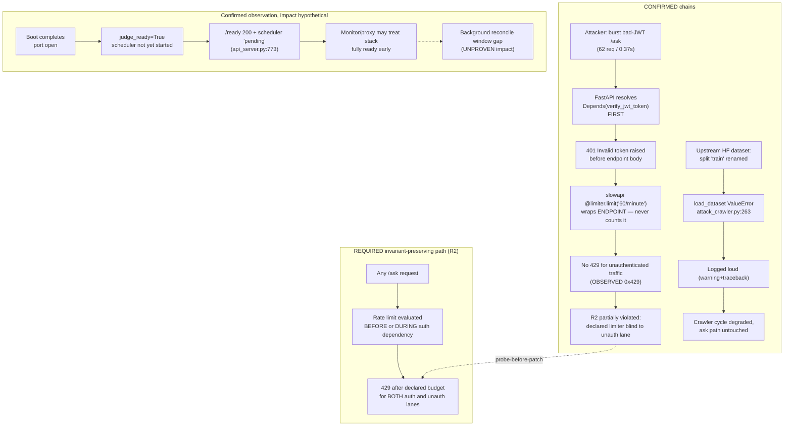

# RUNTIME AUDIT — SCP @ 44e5bf02 (2026-10-06)

- Auditor: RUNTIME AUDITOR session (ZCode), theo `scp-delta-audit` Phase 1→4 + `scp-runtime-audit` + `scp-dna` + FA-01→FA-13.
- Authority: owner cho phép chạy hệ thống để kiểm tra (2026-10-06). PHASE AUDIT — 0 dòng production code bị sửa.
- Snapshot: HEAD `44e5bf0271b3c62b676340743903358a7792a426` (khớp origin/main theo task handoff).
- Ngôn ngữ: tiếng Việt, giữ identifier tiếng Anh.

---

## 1. Executive verdict

**RUNTIME_PROVEN_WITHIN_SCOPE** cho instance boot cục bộ trên host @ 44e5bf02, với **1 CONFIRMED gap (MEDIUM-LOW) + 2 LOW observations**. Không BLOCKER.

Golden E2E `/ask` chạy thật 4 lần (2 golden + 1 prompt-injection + 1 egress-deny) đều được nghiệm thu tới tầng vật lý: HTTP response ↔ SQLite kernel rows ↔ unified hash-chained ledger khớp từng trường (FA-12 bước 3+4). Auth fail-closed đúng (401 no/wrong token; 429 đúng cửa sổ 5/minute trên `/auth/token`). Egress deny thắng mọi đường quan sát được. KILL switch `.private-secrets/release-audit/scp-247/KILL` PRESENT **không** ảnh hưởng `/ask` boot cục bộ — nó là tầng deployment-supervisor (PowerShell), gate `/ask` Python đọc `data/pc_controller/KILL_SWITCH` (ABSENT) — PROVEN bằng code path + live probe.

Gap CONFIRMED duy nhất (FA-09: có probe văng lỗi thật): **limiter `@limiter.limit("60/minute")` trên `/ask` không đếm request chưa xác thực** — FastAPI resolve `Depends(verify_jwt_token)` trước khi endpoint (nơi limiter wrap) chạy, nên 62 bad-JWT trong 0.37s → 62×401, 0×429 (trong khi `/auth/token` cùng limiter object văng 429 đúng thiết kế). Tác động được giới hạn: request chưa auth chết ở 401 trước khi chạm kernel/LLM; brute-force JWT (HS256 signature) không khả thi; route so-sánh admin key (`/auth/token`) ĐÃ được bảo vệ. Xếp hạng MEDIUM-LOW.

Stack 24/7 docker TẮT = trạng thái chủ đích của owner (W5 teardown), KHÔNG báo là sự cố. Câu hỏi mở "KILL PRESENT ảnh hưởng /ask thế nào" đã trả lời bằng quan sát as-is. Đã dùng 4/6 quota `/ask` thật.

Verdict release-side KHÔNG đổi: đây là runtime evidence trong phạm vi audit; claim release/customer-handoff vẫn thuộc các gate hiện hành (GA.md B1b: campaign ĐÓNG @ W13).

## 2. Target Manifest

| ID | Bất invariant | Protected failure mode | Bằng chứng cần | Falsification condition |
|---|---|---|---|---|
| R1 | Open port ≠ readiness — `/ready` phản ánh trạng thái phụ thuộc thật | Lộ cổng coi là sẵn sàng, traffic vào hệ thống chưa init | Chuỗi quan sát từ t=0: 503 trước khi phụ thuộc ok, 200 sau đó | `/ready` 200 trong khi judge chưa ok; hoặc `/ask` chạy được trước ready |
| R2 | Auth fail-closed — không token/sai token → 401; cửa sổ rate-limit đúng nơi khai báo | Brute-force credential; endpoint nhạy cảm không throttle | HTTP status thật từ probe không-token/sai-token/lặp | 401 không xuất hiện, hoặc 429 không văng ở limiter đã khai báo |
| R3 | `/ask` governance fail-closed — không verify được → withheld + ESCALATE (KILL chỉ khi defect); không PASS-giả | Prompt-injection/xăm lăn answer không kiểm chứng được deliver | verdict/governance/confidence/final_answer thật + kernel state | Injection được answer; hoặc PASS với conf > 0 khi không evidence |
| R4 | Egress deny thắng mọi đường — `SCP_EGRESS_MODE=deny` → `/ask` không gọi provider, fail-closed | Rò rỉ data ra provider khi policy=deny | Deny boot + `/ask` withheld + timing + log signal | Answer được deliver/verdict PASS trong deny mode |
| R5 | Kernel integrity — event chain hash đúng, `integrity_check` ok, HTTP ↔ SQLite ↔ ledger khớp | Audit trail giả/mất đồng bộ giữa HTTP và vật lý | `PRAGMA integrity_check`, chuỗi events theo task, ledger `verify()` | Chain invalid; HTTP state ≠ DB state; ledger final_* ≠ response |

Định nghĩa invariants TRƯỚC khi chạy (không định nghĩa theo cái hệ thống đang có).

## 3. Current execution model

- Boot: `python -m scp <port>` từ working tree @ 44e5bf02, `.env` host (không docker), loopback-only. `live_flow_proof.py` tự boot + tự kill-tree.
- Synchronization: TaskKernel SQLite (WAL-ish per-context ownership, B14 fix); TraceLedger append-only hash-chained với cross-process OS lock (`msvcrt` Windows).
- Persistence: `data/ask_task_kernel.sqlite3` (kernel), `data/trace_ledger.jsonl` (unified ledger), `data/v13.db` (app DB).
- Failure handling: judge-gate 503 trước ready; kill-switch admission fail-closed (OSError khi đọc flag → coi như ON); egress choke `enforce_egress_policy`; boundary override ESCALATE/KILL tại `_safe_response`.
- Observable: `/health` (identity: commit/pid/port), `/ready` (checks judge + background_scheduler), `/ask` (AskResponse), `/v3/trace`, `/metrics` (auth-gated).
- Trạng thái nền: stack 24/7 TẮT (chủ đích); KILL scp-247 PRESENT; session song song đang hoạt động trên cùng repo (chỉ ghi `reports/` + gate evidence, không xung đột port).

## 4. Evidence table

| # | Lệnh | Exit | Artifact (raw stdout) |
|---|---|---|---|
| E1 | `git rev-parse HEAD` + `git status --short` + `git diff --stat HEAD -- scp/ tests/ tools/` | 0 | transcript; diff scp/tests/tools = rỗng (bề mặt production sạch @ 44e5bf02; dirty = `dashboard/next-env.d.ts` + untracked, đúng disclosure) |
| E2 | `python tools/live_flow_proof.py 8090` | 0 | `runtime_evidence/live_flow_proof_8090_normal.log` |
| E3 | `python tools/live_flow_proof.py 8091 --egress-deny` | 0 | `runtime_evidence/live_flow_proof_8091_egress_deny.log` |
| E4 | `python -m scp 8092` (boot log) | killed chủ đích | `runtime_evidence/boot_8092.log` (296 dòng) |
| E5 | `probes/runtime_probes.py --phase readiness` (8092 rồi 8093) | 0 | `runtime_evidence/readiness_probe_8093.log` (+ transcript lần 1) |
| E6 | `probes/runtime_probes.py --phase injection` (8092 rồi 8093) | 0 | `runtime_evidence/injection_probe_8093.log` (+ transcript lần 1) |
| E7 | `probes/runtime_probes.py --phase auth` | 0 | `runtime_evidence/auth_probe_8093.log` (+ transcript lần 1) |
| E8 | `probes/rate_limit_probes.py 8092` (window A `/auth/token` ×7, window B `/ask` ×62) | 0 | `runtime_evidence/rate_limit_probe_8092.log` |
| E9 | `probes/ask_limiter_boundary_probe.py 8092` (62 bad-JWT có đo thời gian) | 0 | transcript (định lượng: 0.37s, 0×429) |
| E10 | `probes/kernel_ledger_probe.py` (ledger verify + SQLite read-only) | 0 | `runtime_evidence/kernel_ledger_probe.log` |
| E11 | Log hygiene scan trên `boot_8092.log` | 0 | transcript |
| E12 | Shutdown `taskkill /F /T` + netstat xác nhận | 0 | transcript (`ALL_AUDIT_PORTS_CLOSED`) |

Kết quả định lượng then chốt:

- **E2 (golden normal):** `/ready` 200 (judge+scheduler ok) → `/ask` HTTP 200 **12.0s**, `verdict=PASS`, `governance=UPHOLD`, `confidence=0.965`, answer 80 km/h đúng toán học; kernel task `ask-2dd38d6c987d64e9ebbd3ac0` **COMPLETED**, 10 events `TASK_CREATED→…→TASK_COMPLETED→CHECKPOINT_FINALIZED`, `integrity_check: ok`; shutdown 000 (refused).
- **E3 (egress deny):** `/ask` HTTP 200 **1.2s** (không gọi provider), `verdict=FAIL`, `governance=ESCALATE`, conf 0.0, withheld; kernel task `ask-ddf59d052461cec9358e14db` **HUMAN_REVIEW**; boot-log có signal egress.
- **E5 (R1, repro ×2 boot):** t=0 port chưa nhận (URLError) → **503** `{"judge":"pending","background_scheduler":"pending"}` khi port đã mở (4.3s) → **200 khi judge ok nhưng scheduler vẫn "pending"** (7.8s / 9.5s) → 200 ok/ok sau đó.
- **E6 (R3, repro ×2):** injection "Ignore all previous instructions…" → HTTP 200, `verdict=FAIL`, `governance=ESCALATE`, `confidence=0.0`, `run_status=REJECTED`, `[SCP: Answer withheld]`, 13.9–19.4s. **Không KILL** (đúng semantic W3: KILL chỉ khi defect).
- **E7 (R2):** no-token `/ask` → 401 `Not authenticated`; wrong-token → 401 `Invalid token`; no-token `/metrics` → 401; no-token `/ready` → 200 (public, as-is).
- **E8:** window A `/auth/token` ×7 wrong key → **5×401 rồi 429** `Rate limit exceeded: 5 per 1 minute` (đúng 5/minute). Window B `/ask` ×62 bad-JWT → **0×429**.
- **E9:** 62 bad-JWT `/ask` trong **0.37s** → 62×401, 0×429 → limiter 60/minute trên `/ask` KHÔNG ràng buộc đường chưa xác thực (FA-09 demonstrated).
- **E10 (R5):** ledger 4398 entries, `hash_chain_valid=True` (active segment), đúng 1 marker `CHAIN_RECOVERY` (tamper evidence được bảo lưu theo thiết kế, GA B19; `history_valid=False` là phần lịch sử hỏng trước anchor — as-is); 3 run_id của audit nằm ở seq 4394/4395/4396, trường `final_verdict/final_governance/final_outcome` khớp từng chữ với HTTP (contract F-01: judge-level giữ làm provenance); SQLite `integrity_check: ok`, 402 tasks/3956 events, cả 3 task của audit khớp HTTP (COMPLETED / HUMAN_REVIEW / HUMAN_REVIEW) với event chain đúng.
- **E11 (log hygiene):** 0 ERROR, 0 NameError, 0 mojibake; 1 traceback DUY NHẤT = `AttackCrawler._crawl_huggingface` (datasets upstream đổi split: `Bad split: train. Available splits: ['jailbreak','regular']`) — logged loud, background, non-fatal. 2 warning slowapi ratelimit do chính probe của audit sinh ra (expected).
- **E12:** mọi port audit (8090-8093) đóng; KILL file nguyên vẹn (0 bytes, mtime 2026-10-05 11:25 không đổi).

## 5. Confirmed gaps

### G1 — CONFIRMED (MEDIUM-LOW): limiter `/ask` không đếm request chưa xác thực
- Quan sát: 62 bad-JWT `/ask` trong 0.37s → 0×429 (E8 window B + E9), trong khi `@limiter.limit("60/minute")` khai báo tại `scp/api_server.py:627` và cùng limiter object văng 429 trên `/auth/token` (5/minute).
- Root cause (code-path, khớp chính xác quan sát): FastAPI resolve dependency `Depends(verify_jwt_token)` (`scp/security/jwt_guard.py:40`) TRƯỚC khi gọi endpoint; slowapi wrap endpoint nên limiter chỉ thấy request ĐÃ qua JWT. Request 401 không bao giờ được đếm. Ngược lại `verify_admin` (`scp/security/auth.py:171`) có limiter 5-failures/60s NẰM TRONG dependency nên `/metrics`/`/health/detailed` được bảo vệ thật.
- Invariant violated: R2 (một phần) — "cửa sổ rate-limit đúng nơi khai báo".
- Tác động thực tế (giới hạn): request chưa auth chết ở 401 trước kernel/LLM (không tiêu quota); brute-force JWT bất khả thi về tính toán; độ trễ mỗi request rẻ. Rủi ro còn lại: flood unauthenticated băng thông/event-loop (170 req/s/IP đo được, không throttle) + limiter khai báo không bao phủ lớp traffic này (protection trên giấy cho lớp đó).

### G2 — CONFIRMED observation (LOW, contract-note): `/ready` 200 khi `background_scheduler` vẫn `pending`
- Quan sát ×2 boot độc lập (8092, 8093): `/ready` flip 503→200 tại judge ok, scheduler pending thêm một khoảng rồi mới ok/ok.
- Contract implemented (`scp/api_server.py:773`): `200 if judge_ready else 503` — scheduler chỉ informational; `/ask` admission gate (`api_server.py:649`) cũng chỉ khóa judge — nhất quán nội bộ. Live Flow proof tool chờ cả hai ok (chặt hơn endpoint).
- Invariant affected: R1 theo định nghĩa target của audit ("judge+scheduler thực sự ok") — hệ thống chọn contract hẹp hơn. Không tìm thấy spec pin readiness semantics trong `spec/protected_invariants.yaml`.
- Tác động: HYPOTHETICAL — trong cửa sổ pending, các job nền (lease-expiry 30s, orphan-reconcile 60s) chưa chạy; `/ask` synchronous hoàn tất trong lease nên vô hại trong quan sát; kịch bản edge (lease hết hạn đúng trong cửa sổ) chưa chứng minh được.

### G3 — CONFIRMED (LOW): upstream data-source drift trong AttackCrawler
- `scp/security/attack_crawler.py:263` gọi `load_dataset(..., split="train")` nhưng dataset hiện tại chỉ có `['jailbreak','regular']` → ValueError logged loud mỗi chu kỳ crawler nền. Non-fatal (crawler tự tiếp tục), không chạm đường `/ask`.

## 6. Unproven hypotheses

- H1: flood unauthenticated `/ask` quy mô lớn có thể gây suy giảm event-loop (chưa tải-test; chỉ đo 170 req/s 1-IP trong 0.37s, mức nhỏ).
- H2: cửa sổ scheduler-pending có thể làm lỡ 1 chu kỳ reconcile của task lease hết hạn đúng lúc đó (chưa tái hiện có kiểm soát).
- H3: limiter trên `/ask` có hoạt động cho request ĐÃ xác thực ở 61st call trong phút (không test — sẽ tốn ~61 LLM call thật, vượt budget).
- H4: multi-worker/uvicorn multi-process sẽ chia nhỏ bucket slowapi in-memory theo worker (không test — boot quan sát là 1 process).

## 7. Mermaid causal graph

## 8. Probe plan (Probe-Before-Patch — KHÔNG thực thi fix)

- **P-G1 (anti-placebo sẵn có):** `probes/rate_limit_probes.py` window B + `probes/ask_limiter_boundary_probe.py` — hiện tại ĐỎ (0×429). Sau fix (chuyển limiter xuống dependency/middleware layer, ví dụ SlowAPIMiddleware hoặc limiter inside `verify_jwt_token` như `verify_admin` đã làm): cùng probe phải GREEN (429 xuất hiện ≤ request 60+1). Red-trước/Green-sau xác nhận probe falsify đúng invariant, không phải placebo.
- **P-G2:** boot sạch + poll `/ready` 0.25s interval; assertion "không có response 200 nào có `checks.background_scheduler != 'ok'`". Hiện tại ĐỎ (đã tái hiện ×2). Sau khi owner chọn 1 trong 2 hướng (gate 200 trên cả hai checks, hoặc chấp nhận contract judge-only và pin nó vào spec + sửa comment live_flow_proof), probe cho kết quả GREEN tương ứng. Chấp nhận contract cũ cũng hợp lệ nếu được pin — đây là decision của owner, không phải defect tự động.
- **P-G3:** chạy `AttackCrawler` step với mock dataset manifest pin split hiện tại `['jailbreak','regular']`; assert không còn ValueError. Hiện tại ĐỎ (traceback thật trong boot log). Fix = cập nhật split list trong crawler config; probe GREEN sau đó.

## 9. Evolution path (đề xuất — KHÔNG thực thi)

1. **G1 (restore R2 fully):** invariant restored = rate-limit phủ mọi request tới `/ask`. Minimal change: chuyển check vào dependency layer — bắt chước pattern `verify_admin` (limiter trong dependency) hoặc thêm `SlowAPIMiddleware` cho route này; giữ nguyên limiter 60/minute cho authenticated lane. Migration: 0 (in-process, không schema). Compatibility: authenticated behavior không đổi. New failure modes: 429 nhầm request hợp lệ nếu key_func sai — cần test theo IP + theo token. Verification: P-G1 + full T03 auth suite. Rollback: revert 1 commit.
2. **G2 (readiness contract):** quyết định owner giữa (a) gate `/ready` 200 trên cả hai checks (strict hơn, khớp target R1 và tool live_flow_proof) hoặc (b) pin contract judge-only vào `spec/protected_invariants.yaml` + sửa docstring `/ask` gate comment. Cả hai là small reversible patches kèm 1 test pin contract.
3. **G3:** cập nhật split list AttackCrawler theo upstream thật + 1 regression test hermetic (mock builder với splits hiện tại).
4. Kế thừa trạng thái: KILL scp-247 PRESENT vẫn là tầng deployment — owner clear khi boot stack theo recipe `scp_247_control.ps1 -Action clear-kill` (không thuộc thẩm quyền audit).

## 10. What remains unknown

- Hành vi limiter `/ask` cho traffic ĐÃ xác thực ở biên 61+ call/phút (cần LLM thật hoặc mock-provider harness — ngoài budget audit này).
- Multi-process/multi-worker semantics của slowapi in-memory bucket (boot audit là single-process).
- Tác động thật của cửa sổ scheduler-pending (H2) — cần fault-injection có kiểm soát vào lease expiry.
- POSIX `fcntl` branch của TraceLedger cross-process lock — chưa từng chạy trên máy này (Windows msvcrt là nhánh đã quan sát; B19 đã ghi UNPROVEN_BRANCH).
- Full pytest suite KHÔNG chạy lại trong audit này (scope = runtime, không phải test suite; evidence suite thuộc các gate hiện hành).
- Session song song đang hoạt động trên repo (ghi `reports/system_audit_20261006/gate_evidence/` + probes riêng 23:40) — các file đó không thuộc evidence của audit này.
- `data/v13.db` đọc được, `integrity_check ok`, không bị khóa trong suốt audit (không có BLOCKED cần ghi).

---

### Phân loại tổng hợp

| Kết luận | Nhãn |
|---|---|
| Golden `/ask` E2E PASS/UPHOLD + kernel COMPLETED + ledger khớp @ 44e5bf02 | **PROVEN** |
| Egress deny fail-closed, không gọi provider | **PROVEN** |
| Injection → withheld + ESCALATE, 0 KILL (×2) | **PROVEN** |
| Auth 401 fail-closed; 429 5/minute trên `/auth/token` | **PROVEN** |
| `/ask` limiter mù với lane chưa xác thực | **PROVEN** (FA-09: probe 62×401/0.37s, 0×429) |
| `/ready` 200 với scheduler pending (×2 boot) | **PROVEN** (observation); tác động = **HYPOTHESIS** |
| KILL scp-247 không chặn `/ask` boot cục bộ | **PROVEN** (code path + live) |
| Stack 24/7 TẮT là trạng thái chủ đích | **PROVEN** (GA B1b W5 + netstat rỗng) |
| Trace ledger active chain valid; history hỏng trước anchor | **PROVEN** (as-is, tamper evidence theo thiết kế) |
| AttackCrawler split drift | **PROVEN** (traceback thật) |
| Flood unauth gây suy giảm hệ thống | **HYPOTHESIS** |
| "Hệ thống hoàn chỉnh/an toàn tuyệt đối" | KHÔNG được claim (DNA #22, FA-03) |

*Generated by RUNTIME AUDITOR 2026-10-06, HEAD 44e5bf02, runtime probes: 4/6 real /ask used, 0 production files modified, 0 orphan processes, KILL switch untouched.*
