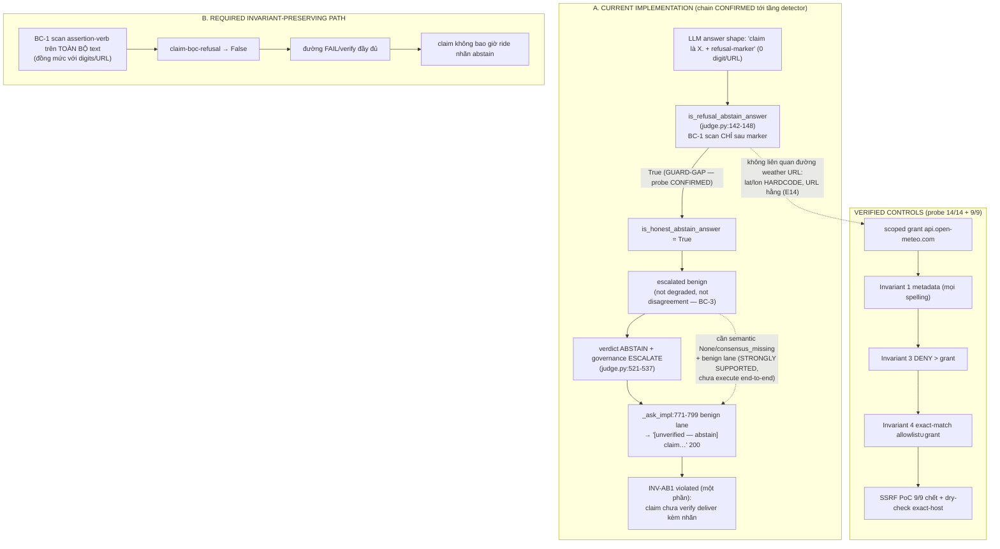

# STATIC DELTA AUDIT — SCP campaign 2026-10-04→06 (W8→W13)

- **Auditor**: DELTA/STATIC AUDITOR (phase audit — KHÔNG sửa production code)
- **Repo**: D:\scp — HEAD `44e5bf0271b3c62b676340743903358a7792a426` (= origin/main, xác minh bằng `git rev-parse` live, không dùng memory)
- **Phạm vi delta chính**: `git diff b13fba9a..44e5bf02` (W12+W13: ConversionDataSource wire, WeatherDataSource Open-Meteo wire, egress scoped grant `api.open-meteo.com`, hardening `eb62b224` — seam `SCP_EGRESS_MODE` + `SafeCommandRunnerTool` await reaping)
- **Phạm vi lens phụ**: `git diff 38bac514..b13fba9a -- scp/` (W9→W11: judge ABSTAIN marker + BC-3 async parity + route-order carve-out) — **mức đọc: full-read** (diff chỉ 22+/3−, đọc 100%)
- **Sweep test toàn campaign**: `git diff a79b6148..44e5bf02 -- tests/` (33 file, +3873/−97)
- **Kỹ năng áp dụng**: `scp-delta-audit` (Phase 1–5.1 + OUTPUT CONTRACT), `scp-dna`, `scp-capability-security-review`. FA-01→FA-13 được đối chiếu từ `.agents/AGENTS.md`/GA.md A4 (không tự bịa nội dung FA).
- **Phân loại bằng chứng**: mọi finding gắn nhãn PROVEN / STRONGLY SUPPORTED / HYPOTHESIS / DISPROVEN / UNKNOWN. Static inferencealone = tối đa HYPOTHESIS. CONFIRMED đòi probe chạy thật (FA-09). Không manufacture finding.

---

## 1. EXECUTIVE VERDICT

**NO VIOLATION PROVEN** trên các trọng tâm kiểm soát cốt lõi của delta W8→W13 — với **1 finding CONFIRMED ở tầng detector (BC-1 asymmetry, MEDIUM)**, **1 finding STRONGLY SUPPORTED về coverage của protected invariants**, và **1 finding CONFIRMED về độ bền evidence (toàn bộ battery evidence của campaign chưa commit)**.

Các claim trọng yếu của W13 đã được **tái chứng minh độc lập bằng probe thực thi** (không tin claim cũ):

- Egress scoped grant: **DENY thắng grant** (Invariant 3 trước Invariant 4), metadata IP chặn vô điều kiện ở mọi spelling (dec/oct/hex/IPv4-mapped), suffix-spoof / userinfo-spoof / subdomain / trailing-host đều bị DENY, đúng 1 host được phép — **probe 14/14 PASS** (`reports/system_audit_20261006/probes/probe_weather_ssrf_egress.py`).
- ConversionDataSource: unknown-unit / cross-category / injection → None (fail-closed), conversion đúng vẫn chạy — **probe 9/9 PASS** (`probes/probe_conversion_failclosed.py`).
- Hardening `eb62b224` **ĐÃ vào main**: tree của `eb62b224^{tree}` == tree của squash `ede074ec^{tree}` == `a288e631cd2bc37362c231c8bfb29d7846a82ea4` — nghi vấn "hardening chưa merge" bị **DISPROVEN**.
- FA-01/FA-02 trên tests/ toàn campaign: **0 test file bị xóa, 0 skip/xfail thật được thêm**, 6 test function bị xóa đều được viết lại CÙNG TÊN trong cùng file (tmp_path isolation), 2 assertion KILL→ESCALATE là chỉnh语义 W3-e1 (giữ assertion verdict FAIL) — không phát hiện weakening ngược chiều.

Finding CONFIRMED duy nhất về code: **BC-1 guard scan assertion-verb chỉ trên text SAU refusal marker** trong `scp/runtime/judge.py::is_refusal_abstain_answer`, trong khi digits/URL scan TOÀN BỘ text → claim đặt TRƯỚC marker (không digits/URL) trượt qua detector abstain (probe chạy thật: 2/5 case GUARD-GAP). Chain deliver đầy đủ còn ở mức STRONGLY SUPPORTED (cần escalated-benign + benign lane — không execute được end-to-end trong audit tĩnh).

Verdict scope: PASS chỉ nghĩa là "không thấy vi phạm trong phạm vi đã kiểm" (DNA #22). Full pytest / battery 3-boot không re-run trong audit này (xem §10).

## 2. TARGET MANIFEST (Phase 1 — 5 invariants bất biến cho delta)

| ID | Invariant | Protected failure mode | Bằng chứng cần để chứng minh tuân thủ | Điều kiện falsify |
|---|---|---|---|---|
| INV-EG1 | Weather scoped grant KHÔNG mở rộng egress ngoài `api.open-meteo.com`; DENY + metadata invariants đứng trên mọi grant | SSRF/metadata exfil qua data source mới | Policy test + probe thực thi trên `EgressPolicy.enforce` | 1 case grant mở được host khác / metadata / DENY-mode |
| INV-CV1 | ConversionDataSource fail-closed: unknown-unit/cross-category → None; question text không chạm được unit lookup ngoài bảng | Bịa hệ số / injection qua câu hỏi | Probe pure-function + bảng hệ số đóng | 1 case trả kết quả cho unit lạ hoặc leak meta-char vào answer |
| INV-AB1 | ABSTAIN-delivery CHỈ trên benign lane kèm nhãn; factual+ABSTAIN withheld; detector abstain KHÔNG được classify answer-có-claim thành abstain | Deliver nội dung factual chưa verify dưới nhãn abstain | Detector probe + branch-order đọc code + contract test | 1 shape claim đi qua detector abstain, hoặc factual+ABSTAIN được deliver |
| INV-TG1 | Time-signal PASS không có evidence tươi phải bị hạ (ABSTAIN benign / FAIL factual) | Stale-fact PASS-thuần (q08 "Joe Biden") | Guard đọc tại boundary + evidence-signal semantics | 1 đường PASS-thuần time-signal không evidence |
| INV-TI1 | Tests trong campaign không bị delete/skip/xfail/weaken (FA-01/FA-02) | Manufacture green | Diff scan tests/ hai chiều (removed/added) | 1 NodeID mất không có replacement cùng-hành-vi, hoặc assertion nới old-fail→new-pass |

## 3. EXECUTION MODEL (Phase 2 — đường thực thi hiện tại)

**Fork data path** (S24 lookup fork, `/ask` không contexts):

```
attempt_lookup_fork (question_router.py:1163)
  → route_question_async → classify_l0 (security → STRONG → pH → LOOKUP
    [W11-f1: weather_fact/finance_fact TRƯỚC interrogative_vi] → creative → WEAK)
  → resolve_lookup_data (1070): _conversion_lookup (local, pure)
    → [domain==weather] _weather_lookup (1023): dry-check _weather_host_allowed (997,
      exact-host + enforce_egress_policy w/ scoped grant)
      → WeatherDataSource.answer_from_question (weather.py:290)
        → _match_city (bảng _cities HARDCODE, word-boundary, diacritic-fold)
        → _fetch_from_open_meteo (366): build_open_meteo_url (float+isfinite,
          host HẰNG) → safe_urlopen(extra_allowed_hosts={api.open-meteo.com})
          → echo-location check (±1.0°) → thiếu temperature → None
  → catalog → wiki → None → LLM fallback
  → relevance gate _terms_covered (1207) → PASS hardcode + marker relevance_gate
    + provenance "input_context_only" → ask_kernel_adapter already_judged + gate
```

**Judge/delivery path** (W7-e5/e6 + W8-e1):

```
judge()/judge_async (judge.py:412 / async) — 3-state {PASS, FAIL, ABSTAIN}
  answer_is_abstain = is_honest_abstain_answer (152) ← tier-1 refusal (123, BC-1)
                       + tier-2 conv (BC-2 closed verb set)
  escalated benign, not degraded, not disagreement (BC-3, sync 513 + async W11-f3)
    → ABSTAIN + governance ESCALATE
_ask_impl boundary:
  [597] W8-e1 time-signal guard: PASS + time-signal + no evidence
        (_web_fallback_used server-controlled | _has_provided_evidence = req.contexts
        [472, user-controlled BY DESIGN] | clean_evidence_snippets đã qua quarantine)
        → chatbot: ABSTAIN-labeled | factual: FAIL+ESCALATE withheld
  [771] ABSTAIN-delivery: benign lane (chatbot HOẶC realtime-no-tool [708-726])
        + answer non-empty → '[unverified — abstain] …' + governance ABSTAIN
  [800/821/840] factual ESCALATE/DEGRADED/FAIL → withheld (branch order bảo đảm
        factual+ABSTAIN rơi withhold, KHÔNG deliver)
ask_kernel_adapter [505]: clearance ABSTAIN = triple (verdict ABSTAIN + governance
  ABSTAIN + prefix nhãn) — cả 3 do server đặt, LLM không kiểm soát
```

**Egress choke**: `safe_urlopen` (url_safety.py:301) → `enforce_egress_policy` (87) → `EgressPolicy.enforce` (policy/egress.py:314) theo thứ tự: Invariant 1 metadata (mọi spelling, `_numeric_host_to_ip`) → 2 loopback → 3 DENY → 4 allowlist ∪ token grant (wildcard chỉ khi entry có tiền tố `*.`) → 5 production+open fail-closed.

## 4. EVIDENCE TABLE

| # | Nhãn | Claim | Vị trí (file:symbol:dòng) | Cách chứng minh |
|---|---|---|---|---|
| E1 | **PROVEN** (probe) | DENY thắng scoped grant; metadata chặn vô điều kiện mọi spelling; suffix/userinfo/subdomain/trailing-host DENY; đúng 1 host ALLOW | `scp/policy/egress.py::EgressPolicy.enforce:314-357`, `scp/security/url_safety.py::safe_urlopen:301-321`, `scp/runtime/question_router.py::_weather_host_allowed:997-1020` | Probe chạy thật `probes/probe_weather_ssrf_egress.py` → **14/14 PASS** tại HEAD 44e5bf02 |
| E2 | **PROVEN** (probe) | Conversion fail-closed unknown/cross-category/injection; hệ số đúng vẫn trả | `scp/data_sources/conversion.py::convert:317-336`, `answer_from_question:338-363`, `_CONV_QUESTION_RE:33-39` (charset giới hạn), `_find_factor:297-315` | Probe chạy thật `probes/probe_conversion_failclosed.py` → **9/9 PASS** |
| E3 | **CONFIRMED** (probe, tầng detector) | BC-1 scan assertion-verb chỉ SAU marker → claim TRƯỚC marker thoát detector abstain; bất đối xứng với digits/URL (scan toàn text) | `scp/runtime/judge.py::is_refusal_abstain_answer:140-149` (so sánh dòng 140 `_ABSTAIN_URL_RE/_DIGIT_RE` trên `text` toàn phần vs dòng 145 `_ABSTAIN_ASSERTION_RE.search(lowered[match.end():])`) | Probe chạy thật `probes/probe_bc1_refusal_order.py` → **2/5 GUARD-GAP**; tier-2 conv (`is_honest_abstain_answer:174-180`) scan toàn text — asymmetry chỉ ở refusal tier |
| E4 | **STRONGLY SUPPORTED** (static path) | Chain deliver đầy đủ của E3: claim-trước-marker → ABSTAIN verdict (escalated benign: semantic None / consensus_missing; disagreement bị loại bởi BC-3) → deliver nhãn trên chatbot lane hoặc carve-out realtime-no-tool | `scp/runtime/judge.py:502-537`, `scp/api_server_parts/_ask_impl.py:708-726 + 771-799`, `scp/api/chat.py:535-563`, `scp/ask_kernel_adapter.py:505-516` | Đọc branch-order full; mitigation: nhãn `[unverified — abstain]` + server-controlled triple clearance. Không execute end-to-end (cần LLM escalation state) → không vượt HYPOTHESIS-toàn-chain |
| E5 | **PROVEN** (git) | Hardening eb62b224 đã vào main (tree identical với squash ede074ec) | `git rev-parse ede074ec^{tree} eb62b224^{tree}` → cùng `a288e631cd2bc37362c231c8bfb29d7846a82ea4`; hardening = `scp/capabilities/tools.py` SafeCommandRunnerTool +13 (await `asyncio.wait_for(process.wait(), timeout=5)` sau kill) + seam test monkeypatch.setenv | Lệnh git live |
| E6 | **PROVEN** (grep+diff) | FA-01/FA-02: 0 test file xóa; +146/−6 test function; 6 cái xóa = rewrite cùng tên `tests/T03_capability/test_flow_07_autofix_scp_standard.py` (tmp_path); 0 `pytest.mark.skip/xfail` thật thêm; 2 assertion KILL→ESCALATE (`tests/T02_contract/test_flow03…`) là chỉnh W3-e1, assertion `verdict == "FAIL"` GIỮ | `git diff a79b6148..44e5bf02 -- tests/ --diff-filter=D` (rỗng); grep `^-.*def test_` (6, tất cả có `^+.*def test_` cùng tên); grep skip chỉ match comment/docstring | Lệnh git live |
| E7 | **PROVEN** (grep) | Silent-except (lớp S110/S112 blind-except) scp/ = 0 — claim W4/W4b giữ đúng; tìm thấy đúng 1 `except asyncio.TimeoutError: pass` narrow-typed (poll loop có chủ đích, không thuộc lớp blind) | `scp/ask_kernel_adapter.py:1312` | Regex scan toàn scp/ |
| E8 | **PROVEN** (tool) | ruff `--select E9,F821,F401` scp/ = All checks passed (claim B21=0 tái xác nhận); bandit B110/B108/B608 scp/ = 0 issue (B108 chỉ nosec đã disclose sẵn `scp/security/os_sandbox.py`) | ruff + bandit 1.9.4 chạy live | Tool output |
| E9 | **PROVEN** (scan) | Secrets: 0 credential-shape trong toàn bộ diff campaign (9 shape class) và 0 trong 257 file evidence untracked (hit "sk-" đầu là false-positive `ask-<task_id>`) | python regex scan `git diff a79b6148..44e5bf02` + 257 file | Tool output |
| E10 | **PROVEN** (git) | Phase 5.1: 0 symbol `def/class/import` bị xóa trong cả 2 delta → không dangling reference; `import scp.runtime.question_router, scp.data_sources.weather, scp.data_sources.conversion, scp.runtime.judge` → IMPORT-OK; `spec/protected_invariants.yaml` + `spec/complete_scp_reference.yaml` + `.agents/skills/` không đổi trong campaign → không source-of-truth contradiction mới | `git diff … | grep "^-.*(def|class|import)"` = rỗng; python import live | Lệnh live |
| E11 | **STRONGLY SUPPORTED** (static) | Protected-invariants coverage drift: engine egress thật là `scp/policy/egress.py::EgressPolicy` + `scp/security/url_safety.py` nhưng `egress.boundary` chỉ pin `scp/llm_gateway/egress_policy.py` (pre-campaign, không do delta gây ra; file pinned không bị đụng trong campaign) | `spec/protected_invariants.yaml:36-39` vs diff campaign (egress_policy.py không nằm trong 115 file đổi) | Đọc + git |
| E12 | **PROVEN** (git status) | Toàn bộ evidence battery campaign (wave1→wave13_battery) UNTRACKED — GA.md B1b tham chiếu chúng | `git status --porcelain` + `ls reports/scp_acceptance_ci/` | Live |
| E13 | **PROVEN** (test file) | Contract deny-beats-grant đã được pin trong test chuẩn (không chỉ probe audit) | `tests/T05_gateway/test_w13_weather_egress.py:72` `test_deny_mode_beats_weather_scoped_grant` (monkeypatch.setenv — hermetic đúng chuẩn EE-G1) | Đọc file |
| E14 | **DISPROVEN** (probe + đọc) | Nghi vấn "question-injection vào weather URL": lat/lon từ bảng HARDCODE, question chỉ match key (word-boundary), URL builder ép float/isfinite, path/query là hằng | `scp/data_sources/weather.py::build_open_meteo_url:99-121`, `_match_city:267-288` | Đọc full + P10 probe |
| E15 | **PROVEN** (đọc) | W11-f3 BC-3 parity sync/async: cả 2 đường đều loại `multi_llm_disagreement` khỏi ABSTAIN | `scp/runtime/judge.py:513` (sync) + diff `38bac514..b13fba9a` judge.py (async `_esc_is_disagreement`) | git diff live |
| E16 | **PROVEN** (đọc) | Judge prompt không nhúng secret/PII: `_judge_system_prompt` = static + current date seam (`judge_llm.py:14-27,30-38`); L2 prompt chỉ nhúng question[:500]; crosscheck dùng cùng prompt | `scp/runtime/judge_llm.py`, `scp/runtime/multi_llm_crosscheck.py` (diff: `_family_key` W3-e2 — family=(base_url,model), residual fallback-model đã disclose) | Đọc full diff |
| E17 | **HYPOTHESIS** (static) | W8 guard "forge evidence": `_has_provided_evidence = bool(req.contexts …)` (`_ask_impl.py:472`) do USER kiểm soát → user gửi contexts tự chế có thể tắt guard; chain còn đòi judge LLM PASS với soft-layer current-date (`judge_llm.py:_judge_system_prompt`) | `_ask_impl.py:597-642 + 472` | Đọc; không probe live-LLM trong audit tĩnh |

## 5. CONFIRMED GAPS

### GAP-1 (CONFIRMED, MEDIUM) — BC-1 detector asymmetry: claim-before-marker thoát detector abstain
- **Vị trí**: `scp/runtime/judge.py::is_refusal_abstain_answer:142-148`.
- **Cơ chế**: vòng `for match in finditer(markers)` chỉ scan `_ABSTAIN_ASSERTION_RE` trên `lowered[match.end():]` (text SAU marker). Digits/URL (dòng 140) scan `text` toàn phần — hai mức độ không nhất quán trong cùng hàm. Answer `"Donald Trump là tổng thống Mỹ. Tôi không thể xác minh thêm."` (0 digits, 0 URL) → `is_refusal_abstain_answer = True` (probe thực thi).
- **Propagation**: `is_honest_abstain_answer` → `answer_is_abstain` (judge.py:424) → escalated-benign (semantic None hoặc consensus_missing; disagreement đã bị BC-3 loại) → verdict ABSTAIN (521-537) → deliver nhãn trên LANE_CHATBOT (`_ask_impl.py:771-799`) hoặc carve-out weather/finance-no-tool (716-726) → adapter clearance triple (server đặt) chấp nhận.
- **Violated invariant**: INV-AB1 (một phần — detector layer). **Observable consequence**: nội dung claim chưa verify được deliver kèm nhãn `[unverified — abstain]` trên benign lane; marker audit `answer_without_verifiable_claim` sai semantics.
- **Giảm nhẹ hiện có**: nhãn vẫn gắn đầu dòng (không deliver thuần); digits/URL toàn text; security tag chặn; chain đòi escalated-benign + LLM sinh đúng shape "claim. refusal-marker". → Severity MEDIUM, không HIGH.
- **Anti-placebo**: probe FAIL (GUARD-GAP) trên code hiện tại; sẽ PASS nếu fix scan toàn text — mutation-tested đúng Phase 4.

### GAP-2 (PROVEN, PROCESS/HIGH-visibility) — Evidence campaign chưa commit
Toàn bộ bundle evidence được GA.md B1b trích dẫn (W1 `wave1/<sha>/`, W6 `wave6/`, `wave6_re/`, W7 `wave7_battery/`, W10 `wave10_battery/`, W11 `wave11_battery/`, W12 `wave12/`+`wave12_battery/`, W13 `wave13/`+`wave13_battery/` nằm trong `reports/scp_acceptance_ci/`) đang **untracked** trên HEAD main. Đây là bài học B18 lặp lại ở cấp campaign: bằng chứng chỉ tồn tại trên máy local, mất theo máy/không kiểm chứng được từ main. Kèm Artifacts runtime trộn lẫn trong cùng thư mục (v13.db, WAL/SHM, server logs, tamper.sqlite3, empty.env — không phải credential, đã scan).

### GAP-3 (STRONGLY SUPPORTED, LOW-MEDIUM) — Protected invariants egress coverage drift
`spec/protected_invariants.yaml::egress.boundary` chỉ bảo vệ `scp/llm_gateway/egress_policy.py`, trong khi enforcement thống nhất thật sự nằm ở `scp/policy/egress.py::EgressPolicy.enforce` + `scp/security/url_safety.py::enforce_egress_policy/safe_urlopen` (pre-campaign) và 2 consumer scoped-grant mới của W13 (`scp/data_sources/weather.py`, `scp/runtime/question_router.py::_weather_host_allowed`). Không phải contradiction (file được pin không bị sửa — E10), nhưng lớp bảo vệ REQUIRE_GOVERNANCE không phủ đúng điểm enforcement hiện hành.

*(Không có gap nào khác được chứng minh. Các nghi vấn còn lại xếp vào §6.)*

## 6. UNPROVEN HYPOTHESES

| ID | Hypothesis | Trạng thái | Vì sao chưa proven |
|---|---|---|---|
| H1 | Forge-evidence mở W8 guard: user gửi `contexts` tự chế ("nguồn" stale) tắt guard → PASS-thuần stale-fact | HYPOTHESIS | `_has_provided_evidence` user-controlled là BY DESIGN (comment `_ask_impl.py:611-614`); chain còn phụ thuộc judge LLM có PASS bất chấp soft-layer current-date. Cần probe live-LLM. |
| H2 | Open-Meteo payload trả temperature/humidity/wind dạng string → f-string nhúng text tùy ý vào answer (`weather.py:421-441` không type-validate) | HYPOTHESIS (LOW) | Host pinned + TLS + tham số cố định; khai thác đòi hỏi compromise API bên thứ 3. Static-only. |
| H3 | End-to-end delivery của GAP-1 (từ detector đến HTTP 200 có nhãn) | HYPOTHESIS-to-chain | Cần escalated-benign thật (semantic judge None / consensus_missing) — không tạo được deterministic trong audit tĩnh; path analysis = STRONGLY SUPPORTED (E4). |
| H4 | `SafeCommandRunnerTool` await-reaping (`tools.py:506-518`) hết triệt để "Event loop closed"/zombie | UNKNOWN | Đã đọc patch (bounded wait 5s sau kill, đúng hướng); không re-run probe 2-unraisable của commit trong audit này. |

## 7. MERMAID CAUSAL GRAPH



## 8. PROBE PLAN (đã thực thi — FA-09)

Các probe chỉ đặt ở `D:\scp\reports\system_audit_20261006\probes\` (viết bằng tool Write, không heredoc), deterministic, không network, không đụng production code:

| Probe | Falsifies | Setup | Trigger | Expected nếu code đúng | Expected nếu hypothesis đúng | Kết quả thực tế |
|---|---|---|---|---|---|---|
| `probe_weather_ssrf_egress.py` | INV-EG1 | EgressPolicy in-process, grant frozenset 1 host | 14 nhóm PoC: DENY+grant, metadata literal/dec/oct/hex/IPv4-mapped, userinfo-spoof, suffix-spoof, subdomain, trailing-host, exact-host, bad coords, dry-check | DENY/ValueError cho mọi case ngoại trừ exact approved host | ≥1 case ALLOWED sai | **14/14 PASS — INV-EG1 giữ** |
| `probe_conversion_failclosed.py` | INV-CV1 | ConversionDataSource thuần | unknown-unit, cross-category ×2, empty, unknown scale, 6 payload injection, 2 conversion đúng | None cho mọi fail-case; meta-char không vào answer | ≥1 trả kết quả/leak | **9/9 PASS (sau khi sửa expectation C9 của chính probe — hành vi source đúng: echo to_unit người dùng gõ)** |
| `probe_bc1_refusal_order.py` | INV-AB1 (detector) | pure judge detectors | 5 case: claim-sau-marker, claim-trước-marker ×2, refusal thuần, digits | claim-trước-marker → False | → True | **2/5 GUARD-GAP → GAP-1 CONFIRMED** |

Anti-placebo: PROBE-1 hiện FAIL-đúng-điều-kiện-giả-thuyết và sẽ PASS sau fix (mutation-tested theo Phase 4). PROBE-2/3 là verification probes — giá trị falsify của chúng là chặn regression tương lai.

## 9. EVOLUTION PATH (đề xuất — KHÔNG implement trong phase audit)

1. **GAP-1 (BC-1)**: sửa `is_refusal_abstain_answer` scan `_ABSTAIN_ASSERTION_RE` trên toàn bộ `lowered` (một lần, ngoài vòng marker) — invariant khôi phục: INV-AB1; migration: 0 (pure function); compatibility: refusal-thuần không chứa copula vẫn True (đã có case pin trong probe); failure mode mới: refusal phrase chứa "là" trong topic-mention ("về thủ đô là gì") sẽ rớt ra đường verify — chấp nhận được (conservative); verification: regression test old-fail/new-pass + re-run probe; rollback: revert 1 hàm. **Chờ owner duyệt** (audit phase cấm sửa code).
2. **GAP-2**: commit các bundle `reports/scp_acceptance_ci/wave*/` (theo chuẩn B18: commit trước, chạy audit trên cây sạch) HOẶC tách runtime-artifact (v13.db, WAL/SHM, logs) ra gitignore — quyết owner; không xóa gì trong audit này.
3. **GAP-3**: qua governance, mở rộng `egress.boundary.path_patterns` thêm `scp/policy/egress.py`, `scp/security/url_safety.py` (+ cân nhắc consumer scoped-grant) — đổi spec, không đổi code.
4. **H2 (optional hardening)**: type-check numeric fields từ payload Open-Meteo trước khi compose text.

## 10. WHAT REMAINS UNKNOWN

1. **Full pytest / region counts chưa re-run** — claim "region 1470 passed", "29 test hermetic", "goldset 1.0000" của W12/W13 được lấy as-is từ GA.md/bundle; audit này không tái thực thi full suite (scope: static + delta + probe đích).
2. **W13 battery 3-boot (A=14/B=15/C=14, q07 PASS-thuần Open-Meteo)** — không re-execute; bundle `wave13_battery/` hiện chỉ tồn tại local (GAP-2), nên claim này chưa bền trên main.
3. **Chain end-to-end của GAP-1** — detector CONFIRMED, delivery full-chain STRONGLY SUPPORTED/HYPOTHESIS (H3) vì phụ thuộc trạng thái escalated-benign của LLM judge thật.
4. **H1 forge-evidence W8** — cần probe live-LLM để quyết có phải bypass thực dụng hay chỉ theoretical.
5. **SafeCommandRunnerTool post-fix behavior** (H4) — chưa re-run unraisable probe.
6. **q03/q16 ESCALATE-flip inherent variance** — ngoài scope delta; gate thống kê W9 đã hấp thụ theo GA.md, không kiểm chứng lại.
7. **Scanner coverage xoay vòng** — audit này dùng regex/pattern tự viết; các lớp shape khác có thể thoát (DNA #19: shared blind spots giữa scanner của tôi và bandit/ruff là có thể).

---

### Phụ lục — Sweep counts (trả lời trực tiếp câu hỏi audit)

| Sweep | Kết quả | Claim đối chiếu |
|---|---|---|
| Silent-except scp/ (blind-except S110/S112 class) | **0** | W4/W4b claim 183→0: GIỮ ĐÚNG (1 hit `except asyncio.TimeoutError: pass` narrow-typed tại `scp/ask_kernel_adapter.py:1312` — poll loop, không thuộc lớp blind) |
| ruff `--select E9,F821,F401` scp/ | **All checks passed (0)** | B21 claim = 0: GIỮ ĐÚNG |
| bandit B110/B108/B608 scp/ | **0 issue** (B108 = nosec disclose sẵn `os_sandbox.py`) | B22 claim = 0: GIỮ ĐÚNG |
| Test-weakening `a79b6148..44e5bf02 -- tests/` | **0 file xóa; +146/−6 def test_ (6 = rewrite cùng tên); 0 skip/xfail thật; 2 assertion KILL→ESCALATE = W3-e1 semantic (verdict FAIL giữ)** | FA-01/FA-02: NO VIOLATION PROVEN |
| Secrets trên diff campaign (115 file) | **0 credential-shape** (9 shape class) | sạch |
| Secrets trên 257 file evidence untracked | **0 credential-shape** (sk- đầu = false-positive `ask-<task_id>`) | sạch |
| Probe SSRF/egress | **14/14 PASS** | W13 claim 9/9: tái xác nhận + mở rộng |
| Probe conversion | **9/9 PASS** | W12 claim fail-closed: tái xác nhận |
| Probe BC-1 | **2/5 GUARD-GAP** | GAP-1 CONFIRMED (detector layer) |
